# Android UI reference pack

**Reference pack revision:** 2.3.2 (tracks the Android UI specification)
**Last verified:** 2026-09-09

This pack separates evidence from the Android presentation contract:

- Shared product behavior comes from the [Ripple PRD](../../Ripple_PRD.md), especially Section 22.
- Android screen behavior comes from the [Android UI specification](../ANDROID_UI_SPEC.md) and architecture from the [Android architecture guide](../ANDROID_ARCHITECTURE.md).

- The existing iOS PNGs are evidence of the current product hierarchy and visual priorities.
- The PNGs in this directory are normative Android layout references. They name Android-native controls and responsive behavior; they are not pixel-perfect iOS copies.
- Real Android emulator and Wear captures are the final acceptance artifacts. These layout images do not replace runtime verification.

## iOS evidence

- [iPhone Today](../../screens/ios/iphone-today.png)
- [iPhone History](../../screens/ios/iphone-history.png)
- [iPhone Stats](../../screens/ios/iphone-stats.png)
- [iPad Settings](../../screens/ios/ipad-settings.png)
- [Watch Today](../../screens/ios/watch-today.png)
- [Watch History](../../screens/ios/watch-history.png)
- [Watch Stats](../../screens/ios/watch-stats.png)

## Android layout contracts

| Reference | Contract |
|---|---|
| `phone-today.png` | Four-root phone shell; contained glass hero; saved containers; custom amount; no Recent list |
| `phone-history.png` | Horizontal month pager; weekday grid; one capped ring per day; future days disabled |
| `phone-day-detail.png` | Nested Day Detail; localized weekday/date top-app-bar title without a duplicate compact content heading, static contained glass/readout summary, goal and remaining status, intake rows, edit/delete/restore, add only for today |
| `phone-stats.png` | Week/Month/Year selector; summaries; four chart families; highlights |
| `phone-settings.png` | Profile, goal, containers, reminders, Health, sync, export, about |
| `phone-onboarding.png` | Six onboarding pages and native permission handoffs |
| `tablet-history-split.png` | Expanded History calendar/detail split |
| `tablet-stats.png` | Expanded Stats with persistent navigation and chart content |
| `wear-today.png` | Full-canvas water field; predefined actions; Crown-first custom amount |
| `wear-history.png` | Seven elapsed local days; Wear-native list |
| `wear-day-detail.png` | Wear Day Detail; individual intake deletion |
| `wear-stats.png` | Current ISO-week summary; one compact chart |

## Layout previews

These images are the visual layout references for the Android port. They show
information hierarchy, responsive composition, and native Android control
placement; they are not pixel targets for iOS or a request to reproduce iOS
chrome.

### Phone

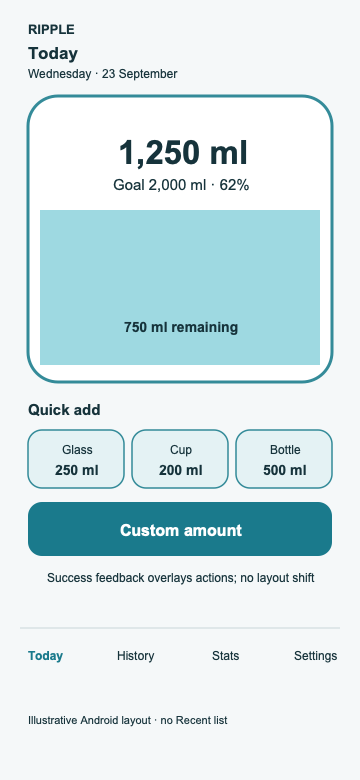

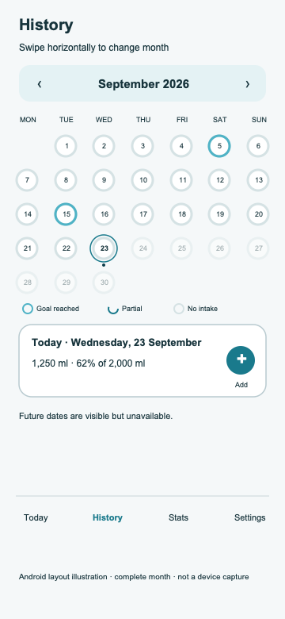

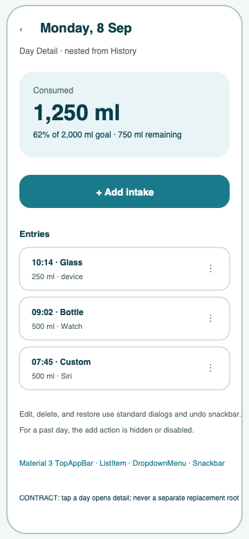

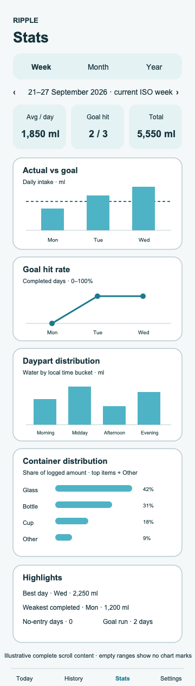

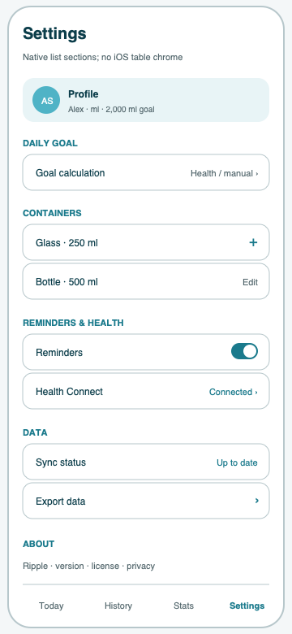

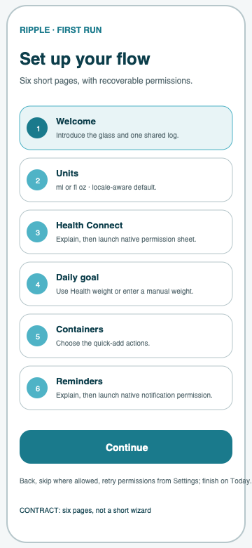

### Tablet

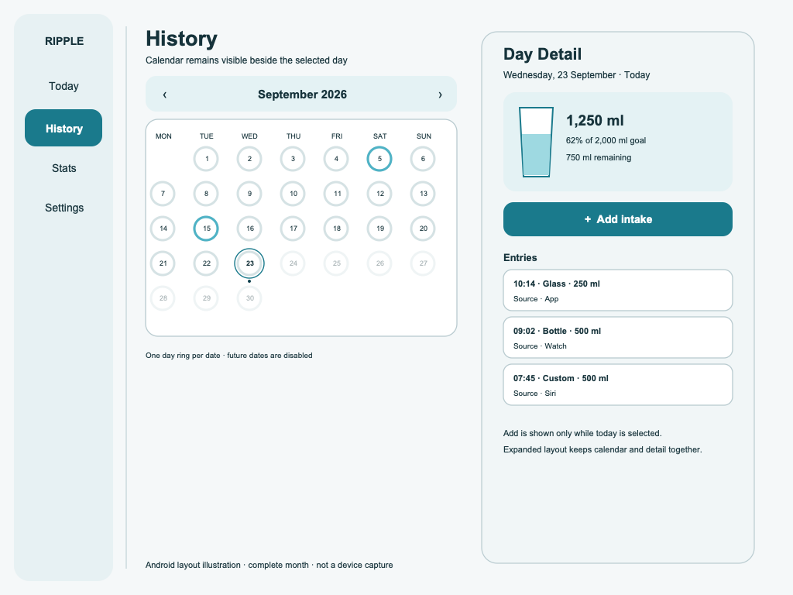

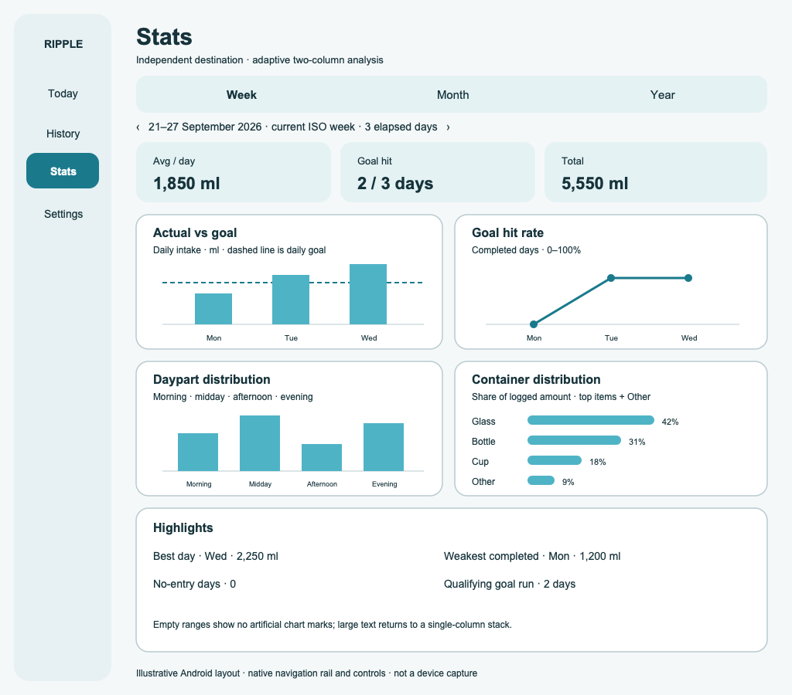

### Wear OS

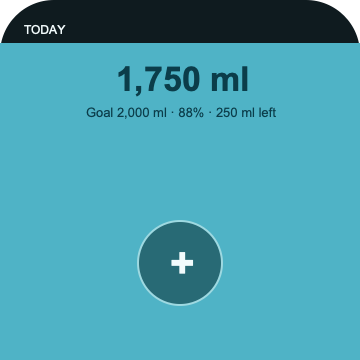

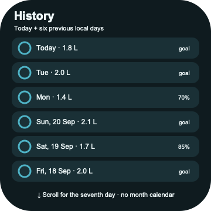

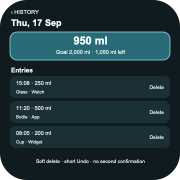

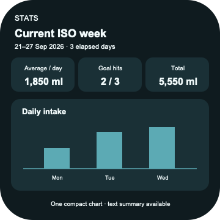

The pack contains documentation only. The Day Detail summary region is the
structural reference for the static contained glass/readout; its exact geometry,
side-inset rule, and accessibility behavior are normative in
`ANDROID_UI_SPEC.md` §5.2 and §10. The pack does not authorize copying Liquid
Glass, an iOS tab bar, or iOS navigation chrome into Android. Android uses
Material 3, Window Size Classes, standard Android permission surfaces, and
Wear-native navigation while preserving the same screens, information
priority, and flows.
