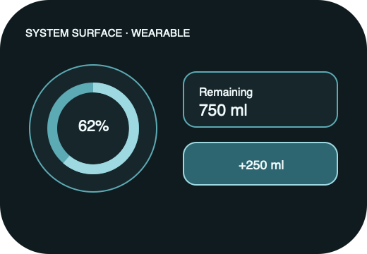

# Ripple Surface — Complication

**Stable surface ID:** `complication`
**Surface contract version:** 1.1.1
**Last verified:** 2026-09-23
**Kind:** System surface
**Localized name:** Platform-local complication name

This is the canonical contract for a wearable system complication or equivalent
at-a-glance surface.

## Purpose and user outcome

The user glances at remaining/goal or current level and, only where the host
allows an explicit action, starts a focused logging action.

## Entry and exit

The operating system renders a projection of the shared snapshot. Tapping an
action may invoke `LogIntake` through the shared adapter or open the owning app
surface. The complication never becomes a calendar, Stats chart, or full
Today screen.

## Layout and region order

Show one focused representation appropriate to the host family:

1. Level, remaining amount, or goal status.
2. Optional small localized amount/unit.
3. Optional explicit action affordance.

## Reference evidence and visible-element inventory

**Reference set:** [shared complication wireframe](../wireframes/complication--ready--wearable.png); no runtime capture is currently designated
**Reference classification:** Current shared system-surface illustration.
**States/viewports inspected:** Ready, stale/unavailable, and action-supported/read-only variants.
**System-owned chrome excluded from the shared wireframe:** Host family geometry, placement, refresh cadence, and watch-face chrome.

**Required product-owned composition:** Focused remaining/goal or capped progress; actual amount accessible; optional positive amount/unit action; explicit stale state.

The complete element-by-element inventory, reference identity, crop/state notes,
and reconciliation decisions are maintained in the [Ripple visual reference
inventory](../Ripple_VISUAL_REFERENCE_INVENTORY.md#complication). The linked
review note is part of this surface contract; it does not authorize behavior
outside the PRD or replace the native platform mapping.

## Platform-independent wireframes

Editable source: [complication--ready--wearable.svg](../wireframes/complication--ready--wearable.svg).

Caption: Representative ready state in the wearable semantic viewport; shared surface contract version 1.1.1. The neutral illustration shows hierarchy only and does not prescribe native navigation or control appearance.

## Read model

Read only projection data. Keep actual amounts accessible even when visual
progress is capped at 100 percent.

## States

Stale/unavailable data is indicated by the host-appropriate status. A supported
action remains unavailable or reports its result. Local persistence stays
authoritative if synchronization or another projection fails. Reduced motion is
always static.

## Actions and domain operations

A supported action calls `LogIntake` with the proper system source or opens the
owning app surface. A read-only complication performs no mutation.

## Validation and destructive behavior

An action is offered only when a positive configured amount resolves. There is
no destructive action on a complication.

## Accessibility and large text

Announce remaining/goal, consumed context where available, unit, and action
meaning. The system owns placement, family geometry, refresh cadence, and
interaction chrome. Ripple owns semantic values and localized labels.

## Design tokens and reusable elements

Use shared snapshot formatting, water/goal roles, type, contrast, and
accessibility tokens from [`../Ripple_DESIGN_SYSTEM.md`](../Ripple_DESIGN_SYSTEM.md).
Forbidden: calendar, Stats chart, direct persistence, pour stream, tilt, idle
animation, or a hidden stale state.

## Responsive/platform-independent behavior

The host may change family geometry, placement, and refresh cadence; the
focused value/action priority remains unchanged.

## Forbidden behavior

Calendar, Stats chart, direct persistence, pour stream, tilt, idle animation,
or a hidden stale state is forbidden.

## Timeline

| Version | Date | Change | Impact |
|---|---|---|---|
| 1.0.0 | 2026-09-11 | Established the canonical platform-independent Complication description. | iOS and Android share one semantic surface outcome and action boundary. |
| 1.1.0 | 2026-09-18 | Added the shared ready-state wireframe and verified the contract against the Apple 1.1 baseline. | Android receives a current neutral layout reference without replacing native controls or runtime evidence. |

| 1.1.1 | 2026-09-23 | Added current-reference classification and a linked visible-element inventory for this surface. | Product-owned regions, state/viewport coverage, and system-chrome exclusions are traceable for the cross-platform handoff. |

## Related contracts

- [`../Ripple_PRD.md`](../Ripple_PRD.md)
- [`../Ripple_SCREEN_CATALOG.md`](../Ripple_SCREEN_CATALOG.md)
- [`../Ripple_DESIGN_SYSTEM.md`](../Ripple_DESIGN_SYSTEM.md)
- [`../Ripple_DATA_MODEL.md`](../Ripple_DATA_MODEL.md)
- [`../IOS_ARCHITECTURE.md`](../IOS_ARCHITECTURE.md)
- [`../Android/ANDROID_ARCHITECTURE.md`](../Android/ANDROID_ARCHITECTURE.md)
- [`../Android/ANDROID_UI_SPEC.md`](../Android/ANDROID_UI_SPEC.md)
- [`watch-today.md`](watch-today.md)
