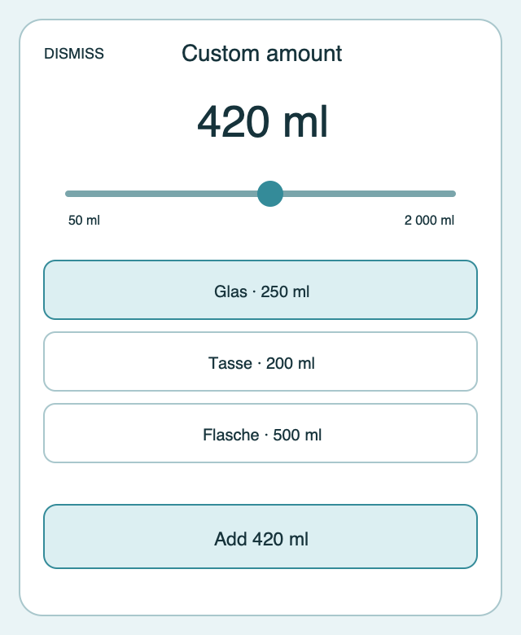

# Ripple Surface — Custom amount

**Stable surface ID:** `custom-amount`
**Surface contract version:** 1.1.1
**Last verified:** 2026-09-23
**Kind:** Sheet
**Localized name:** `Benutzerdefinierte Menge` / `Custom amount`

This is the canonical description of the custom amount entry surface.

## Purpose and user outcome

The user can choose any valid amount and optionally use a saved container as a
preset before logging exactly one intake. The slider is the amount authority;
container selection is a convenient preset/metadata choice and never hides
the ability to adjust the amount.

## Entry and exit

The surface opens from Today or from today's Day Detail. Cancel, back, or
platform dismissal discards the draft and returns without mutation. Add calls
`LogIntake`; after successful local persistence the surface dismisses and the
owning surface shows localized transient confirmation.

## Layout and region order

1. Dismiss/cancel action and localized title.
2. Large numeric amount readout with unit.
3. Continuous amount slider with visible minimum, maximum, current value, and
   meaningful step.
4. A horizontal selectable presentation of **all** saved containers. There is
   no separate “Containers” heading. Each option is wide enough to show its
   icon, localized name, and amount; the selected option is distinct.
5. Full-width primary Add action.

The slider appears before the container selection. The all-container region may
wrap or reflow when needed, but it must not become an unlabeled hidden region.

## Reference evidence and visible-element inventory

**Reference set:** [shared custom-amount wireframe](../wireframes/custom-amount--ready--compact.png); no runtime capture is currently designated
**Reference classification:** Current shared semantic wireframe; native sheet expression is delegated to platform contracts.
**States/viewports inspected:** Ready compact, invalid/loading, and large-text reflow described by the surface contract.
**System-owned chrome excluded from the shared wireframe:** Native sheet drag handle, keyboard/rotary chrome, and platform dismissal affordances.

**Required product-owned composition:** Dismiss/title; amount readout and unit; min/max/step amount control; every saved container with icon/name/amount and selected state; full-width Add action.

The complete element-by-element inventory, reference identity, crop/state notes,
and reconciliation decisions are maintained in the [Ripple visual reference
inventory](../Ripple_VISUAL_REFERENCE_INVENTORY.md#custom-amount). The linked
review note is part of this surface contract; it does not authorize behavior
outside the PRD or replace the native platform mapping.

## Platform-independent wireframes

Editable source: [custom-amount--ready--compact.svg](../wireframes/custom-amount--ready--compact.svg).

Caption: Representative ready state in the compact semantic viewport; shared surface contract version 1.1.1. The neutral illustration shows hierarchy only and does not prescribe native navigation or control appearance.

## Read model and draft

Read `TodaySnapshot.containers`, the preferred display unit, locale, and the
initial draft amount. The draft contains an integer amount and optional
`containerId`. Moving the slider or selecting a container changes only this
local draft. Selecting a container may initialize the amount to that
container's stored amount when the surface is first opened, but later slider
movement is authoritative.

## Actions and domain operations

| User action | Operation | Result |
|---|---|---|
| Move amount control | Local draft update | Readout and accessible value update continuously; no intake is stored. |
| Select a saved container | Local `containerId`/preset update | Selection changes without logging and the amount remains editable. |
| Add | `LogIntake` with positive draft amount, source `app`, and optional container ID | One intake is stored, projections run, feedback appears, and the sheet dismisses. |
| Cancel/dismiss | Discard local draft | Return without mutation. |

## States

- **Loading:** Keep title and amount-entry shell stable; disable Add until the
  required read model is available.
- **Empty containers:** Permit a valid custom amount with no selection.
- **Ready:** Show slider and every saved container.
- **Invalid:** Disable Add and explain the allowed range or missing value.
- **Offline/sync unavailable:** Permit local logging and report projection
  status separately.
- **Success:** Dismiss only after local persistence accepts the command.
- **Reduced motion:** Remove decorative focus/picker transitions.

## Validation and destructive behavior

The domain amount is a positive integer milliliter value. The standard range
is 50–2,000 ml in 10 ml steps; display-unit conversion rounds deterministically
before `LogIntake`. The amount is clamped to the range before confirmation.
Cancel is non-destructive and there is no delete action on this surface.

## Accessibility and large text

The amount control exposes minimum, maximum, current value, unit, and
adjustable input actions. Each container option announces selected state,
localized name, icon meaning, and amount. Add announces the final amount and
selected container, if any. The platform's touch, keyboard, rotary, and
assistive input alternatives remain available. Large text may increase surface
height or wrap options; it must not hide Add.

## Design tokens and reusable elements

Use the sheet surface contract, `GlassCard` where a grouped region is needed,
`ContainerChip`, `LogButton`, native slider semantics, and `RippleToast` after
completion. Use monospaced-digit numeric typography and all token values from
[`../Ripple_DESIGN_SYSTEM.md`](../Ripple_DESIGN_SYSTEM.md).

## Responsive/platform-independent behavior

The surface may be centered, side-aligned, or presented as a bottom-attached
modal according to the platform. The amount control remains above the complete
container selection. Options may wrap or use a platform-appropriate selectable
layout while preserving name, icon, amount, and selected state.

## Forbidden behavior

- A stepper as the only amount input.
- A visible redundant “Containers” heading.
- A selector that exposes only the first three containers.
- Keyboard entry as the only input path.
- Storing an intake while merely moving the slider or selecting a container.
- A full-width action that is hidden below an unannounced overflow region.

## Timeline

| Version | Date | Change | Impact |
|---|---|---|---|
| 1.0.0 | 2026-09-11 | Established the canonical platform-independent Custom amount description. | iOS and Android share one semantic surface outcome and action boundary. |
| 1.1.0 | 2026-09-18 | Added the shared ready-state wireframe and verified the contract against the Apple 1.1 baseline. | Android receives a current neutral layout reference without replacing native controls or runtime evidence. |

| 1.1.1 | 2026-09-23 | Added current-reference classification and a linked visible-element inventory for this surface. | Product-owned regions, state/viewport coverage, and system-chrome exclusions are traceable for the cross-platform handoff. |

## Related contracts

- [`../Ripple_PRD.md`](../Ripple_PRD.md)
- [`../Ripple_SCREEN_CATALOG.md`](../Ripple_SCREEN_CATALOG.md)
- [`../Ripple_DESIGN_SYSTEM.md`](../Ripple_DESIGN_SYSTEM.md)
- [`../Ripple_DATA_MODEL.md`](../Ripple_DATA_MODEL.md)
- [`../IOS_ARCHITECTURE.md`](../IOS_ARCHITECTURE.md)
- [`../Android/ANDROID_ARCHITECTURE.md`](../Android/ANDROID_ARCHITECTURE.md)
- [`../Android/ANDROID_UI_SPEC.md`](../Android/ANDROID_UI_SPEC.md)
- [`today.md`](today.md)
