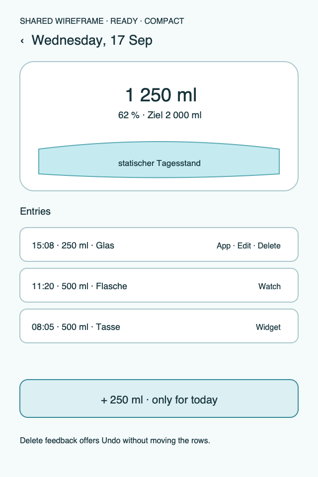
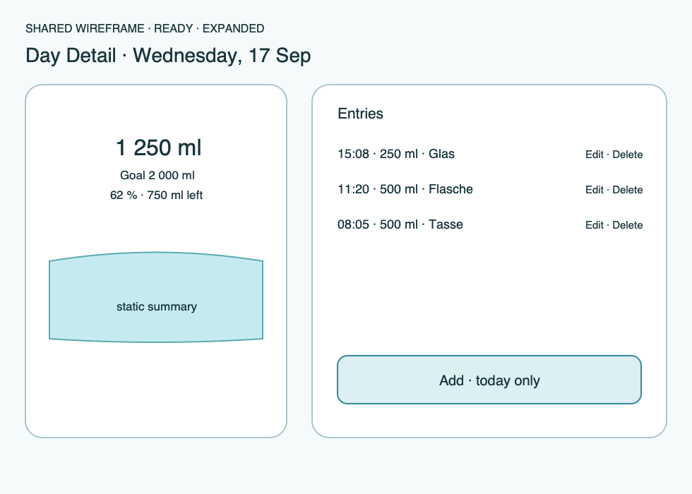

# Ripple Surface — Day Detail

**Stable surface ID:** `day-detail`
**Surface contract version:** 1.1.1
**Last verified:** 2026-09-23
**Kind:** Child screen
**Localized name:** `Tagesdetail` / `Day Detail` when a standalone title is needed

This is the canonical description of entry-level detail for one local calendar
day.

## Purpose and user outcome

The user can inspect every intake for one clearly selected day, understand the
static day summary, and manage existing entries without confusing a past day
with today.

## Entry and exit

The surface opens from an allowed History day. Back or dismissal returns to the
owning History or Today context. The selected date remains visible in the
navigation context. Add is available only when the selected date is today and
opens [`custom-amount.md`](custom-amount.md).

## Layout and region order

1. Selected date and navigation context.
2. Static day summary: contained glass/readout, consumed amount, goal, and
   remaining or goal-reached status.
3. Chronological intake rows.
4. An inline empty state when there are no entries.
5. A today-only primary Add action.

The summary is static historical context: no pour stream, tilt, or continuous
hero animation is used here. On larger surfaces the summary may sit beside the
rows, but it remains before the entries in semantic reading order.

## Reference evidence and visible-element inventory

**Reference set:** [Android phone Day Detail](../Android/UI/phone-day-detail.png), [Android tablet History split](../Android/UI/tablet-history-split.png), and [shared compact/expanded wireframes](../wireframes/day-detail--ready--compact.png)
**Reference classification:** Android supporting evidence and current shared semantic wireframes; no dedicated Apple capture.
**States/viewports inspected:** Today with add, past day without add, compact nested detail, and expanded split detail.
**System-owned chrome excluded from the shared wireframe:** Native top app bar, rail/sidebar, back gesture, and destructive confirmation surface.

**Required product-owned composition:** Selected date context; static contained summary with consumed/unit, goal, and remaining/status; Entries heading; chronological rows with time/amount/container/source and actions; today-only Add; empty/error/undo feedback.

The complete element-by-element inventory, reference identity, crop/state notes,
and reconciliation decisions are maintained in the [Ripple visual reference
inventory](../Ripple_VISUAL_REFERENCE_INVENTORY.md#day-detail). The linked
review note is part of this surface contract; it does not authorize behavior
outside the PRD or replace the native platform mapping.

## Platform-independent wireframes

Editable source: [day-detail--ready--compact.svg](../wireframes/day-detail--ready--compact.svg).

Caption: Representative ready state in the compact semantic viewport; shared surface contract version 1.1.1. The neutral illustration shows hierarchy only and does not prescribe native navigation or control appearance.

Editable source: [day-detail--ready--expanded.svg](../wireframes/day-detail--ready--expanded.svg).

Caption: Representative ready state in the expanded semantic viewport; shared surface contract version 1.1.1. The neutral illustration shows hierarchy only and does not prescribe native navigation or control appearance.

## Read model

Use `HistorySnapshot` for the selected local day, `DaySummary`, and the ordered
intake rows. Each row may include time, amount, unit, beverage/container
metadata, source, stable ID, and soft-deleted state according to the data
model. Totals are derived from the domain snapshot, not recomputed from a
secondary health projection.

## Actions and domain operations

| User action | Operation | Result |
|---|---|---|
| Refresh/open day | `ObserveHistory` | Update summary and chronological rows for the selected day. |
| Add on today | Open `custom-amount`, then `LogIntake` | Store one intake, update the summary, show localized transient confirmation, and remain in the day context. |
| Edit an existing row | Open [`edit-intake.md`](edit-intake.md), then `EditIntake` | Update the original intake identity and refresh totals; do not append a replacement row. |
| Delete a row | `DeleteIntake` after the platform's confirmation affordance | Soft-delete the row and offer the defined undo/restore feedback. |
| Restore an eligible row | `RestoreIntake` | Restore the original row and update the summary. |

## States

- **Loading:** Retain selected date context and announce row/summary loading.
- **Empty:** Show no-entry copy and Add only for today.
- **Ready:** Show static summary and chronological rows.
- **Past day:** Allow inspection and entry management, but no Add.
- **Mutation error:** Keep the row/draft visible and explain retry.
- **Delete success:** Remove the row softly and expose undo/restore feedback.
- **Offline/sync unavailable:** Keep local data and mutations usable where the
  domain permits; show projection status inline.
- **Reduced motion:** Keep summary static and remove decorative transitions.

## Validation and destructive behavior

Delete is soft and recoverable while the defined undo/restore window applies.
The platform must provide an appropriate confirmation affordance for a
destructive action; a single accidental tap must not silently erase an entry.
Editing calls `EditIntake` on the existing identity. No hard deletion is
permitted without the export/recovery contract.

## Accessibility and large text

The summary announces selected date, total, goal, percentage, and remaining
status before the row collection. Each row announces time, amount, unit,
beverage/container when known, source when relevant, and available actions.
Delete and restore explain their consequence and undo availability. Large text
may increase row height and summary height but must not hide the Add or action
labels.

## Design tokens and reusable elements

Use `DayHeader`, `GlassCard`, static hero/readout/water primitives, `IntakeRow`,
`EmptyState`, `LogButton`, `RippleToast`, and `SyncStatusView`. Use the shared
type, color, spacing, shape, and motion tokens from
[`../Ripple_DESIGN_SYSTEM.md`](../Ripple_DESIGN_SYSTEM.md).

## Responsive/platform-independent behavior

Compact layouts keep the selected date in top navigation context and avoid an
unnecessary duplicate heading. Regular or expanded layouts may show the date
inside the detail region and place summary beside rows. The outcome and
reading order remain unchanged.

## Forbidden behavior

- Adding to a past day.
- Editing by inserting a new row.
- Hard deletion or a second distributed undo stack.
- A moving historical hero or pour stream.
- Health or sync projection data replacing the domain day total.

## Timeline

| Version | Date | Change | Impact |
|---|---|---|---|
| 1.0.0 | 2026-09-11 | Established the canonical platform-independent Day Detail description. | iOS and Android share one semantic surface outcome and action boundary. |
| 1.1.0 | 2026-09-18 | Added the shared ready-state wireframes and verified the contract against the Apple 1.1 baseline. | Android receives a current neutral layout reference without replacing native controls or runtime evidence. |

| 1.1.1 | 2026-09-23 | Added the visible-element inventory and clarified goal/remaining content in the expanded Day Detail wireframe. | Day Detail references now preserve summary, entries, actions, and compact/expanded state differences. |

## Related contracts

- [`../Ripple_PRD.md`](../Ripple_PRD.md)
- [`../Ripple_SCREEN_CATALOG.md`](../Ripple_SCREEN_CATALOG.md)
- [`../Ripple_DESIGN_SYSTEM.md`](../Ripple_DESIGN_SYSTEM.md)
- [`../Ripple_DATA_MODEL.md`](../Ripple_DATA_MODEL.md)
- [`../IOS_ARCHITECTURE.md`](../IOS_ARCHITECTURE.md)
- [`../Android/ANDROID_ARCHITECTURE.md`](../Android/ANDROID_ARCHITECTURE.md)
- [`../Android/ANDROID_UI_SPEC.md`](../Android/ANDROID_UI_SPEC.md)
- [`history.md`](history.md)
- [`custom-amount.md`](custom-amount.md)
- [`edit-intake.md`](edit-intake.md)
