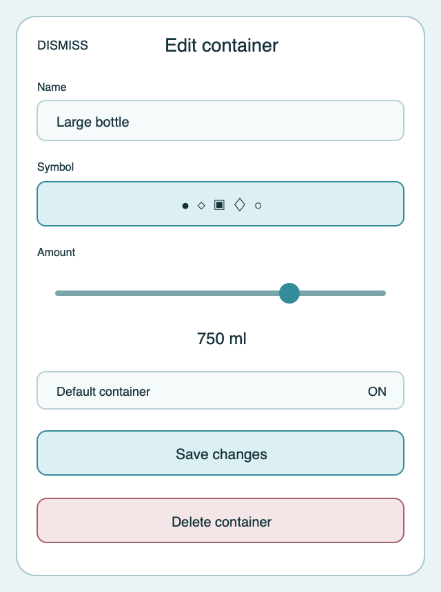

# Ripple Surface — Edit container

**Stable surface ID:** `edit-container`
**Surface contract version:** 1.1.1
**Last verified:** 2026-09-23
**Kind:** Sheet
**Localized name:** `Behälter bearbeiten` / `Edit container`

This is the canonical description of changing an existing saved container.

## Purpose and user outcome

The user changes the existing container's name, icon, amount, or default
status while preserving its stable identity and historical references.

## Entry and exit

The sheet opens from a Settings container row. Cancel/back/dismissal returns
unchanged. Save calls `UpsertContainer` with the same stable ID. Delete is a
separate, explicit destructive action with confirmation and is not triggered by
Save.

## Layout and region order

Use the same semantic order as [`add-container.md`](add-container.md),
prepopulated with current values:

1. Dismiss/cancel and title identifying the container.
2. Name field.
3. Horizontal icon-only selection.
4. Amount readout and slider.
5. Default-container control.
6. Inline validation.
7. Save action.
8. Separated destructive Delete action.

The current icon and default state are visible on entry. The sheet does not
silently remove a container because its default control is off.

## Reference evidence and visible-element inventory

**Reference set:** [shared edit-container wireframe](../wireframes/edit-container--ready--compact.png); no runtime capture is currently designated
**Reference classification:** Current shared semantic wireframe.
**States/viewports inspected:** Ready compact, invalid, delete confirmation, save/delete error, and large-text sheet.
**System-owned chrome excluded from the shared wireframe:** Native editor sheet, input controls, and destructive confirmation dialog.

**Required product-owned composition:** Existing-container identity/title; name, icon-only selection, amount/readout/slider, and default state; inline validation; Save; separated destructive Delete with consequence explanation.

The complete element-by-element inventory, reference identity, crop/state notes,
and reconciliation decisions are maintained in the [Ripple visual reference
inventory](../Ripple_VISUAL_REFERENCE_INVENTORY.md#edit-container). The linked
review note is part of this surface contract; it does not authorize behavior
outside the PRD or replace the native platform mapping.

## Platform-independent wireframes

Editable source: [edit-container--ready--compact.svg](../wireframes/edit-container--ready--compact.svg).

Caption: Representative ready state in the compact semantic viewport; shared surface contract version 1.1.1. The neutral illustration shows hierarchy only and does not prescribe native navigation or control appearance.

## Read model and draft

Read the selected `Container`, all containers for default/order validation, the
icon catalog, preferred unit, locale, and historical-reference policy. The
draft retains the selected stable ID and changes only editable fields.

## Actions and domain operations

| User action | Operation | Result |
|---|---|---|
| Edit name/icon/amount/default | Local draft update | Update preview and validation without persistence. |
| Save | `UpsertContainer` | Update the same container identity, normalize order/default, refresh Settings, and dismiss. |
| Delete | `DeleteContainer` after explicit confirmation | Apply documented fallback/retention behavior, return to Settings, and refresh the ordered collection. |
| Cancel/dismiss | None | Discard the draft. |

## States

- **Loading:** Keep title and identity context while values resolve.
- **Ready:** Show current values and selected icon/default state.
- **Invalid:** Disable Save and identify the exact correction.
- **Delete confirmation:** State impact on existing intake history and
  fallback/default behavior.
- **Delete/save error:** Keep the editor open and retain the draft.
- **Success:** Return to Settings with order/default state refreshed.
- **Reduced motion:** Remove decorative transitions.

## Validation and destructive behavior

Use the same name and amount rules as Add container. Changing default
atomically clears the old default. Deleting a container never rewrites
historical intakes; it follows the data model's stable-ID/display-retention
policy. Container deletion is not part of intake undo.

## Accessibility and large text

The selected icon, amount, and default status are announced. Delete is clearly
separated, destructive, and explicit about consequences. Save announces that
it updates the existing container. Large text may increase sheet height but
must keep Save and Delete discoverable in order.

## Design tokens and reusable elements

Use exactly the Add container contract: `ContainerSymbolPicker`, native text
entry, slider, toggle, `GlassCard`, shared actions, and tokens from
[`../Ripple_DESIGN_SYSTEM.md`](../Ripple_DESIGN_SYSTEM.md). Do not create an
editor-only visual language.

## Responsive/platform-independent behavior

Fields may reflow vertically or into wider regions, but identity → editable
values → validation → Save → Delete remains the semantic order. The platform's
native confirmation and dismissal affordances are retained.

## Forbidden behavior

- Creating a replacement container instead of updating the same ID.
- Changing historical intake values when a container changes.
- Deleting on a non-explicit gesture.
- A separate icon/token system from Add container.
- Allowing two effective defaults.

## Timeline

| Version | Date | Change | Impact |
|---|---|---|---|
| 1.0.0 | 2026-09-11 | Established the canonical platform-independent Edit container description. | iOS and Android share one semantic surface outcome and action boundary. |
| 1.1.0 | 2026-09-18 | Added the shared ready-state wireframe and verified the contract against the Apple 1.1 baseline. | Android receives a current neutral layout reference without replacing native controls or runtime evidence. |

| 1.1.1 | 2026-09-23 | Added the visible-element inventory and the separated destructive Delete action to the ready-state wireframe. | Container editing references now preserve identity, editable values, Save, Delete, and confirmation semantics. |

## Related contracts

- [`../Ripple_PRD.md`](../Ripple_PRD.md)
- [`../Ripple_SCREEN_CATALOG.md`](../Ripple_SCREEN_CATALOG.md)
- [`../Ripple_DESIGN_SYSTEM.md`](../Ripple_DESIGN_SYSTEM.md)
- [`../Ripple_DATA_MODEL.md`](../Ripple_DATA_MODEL.md)
- [`../IOS_ARCHITECTURE.md`](../IOS_ARCHITECTURE.md)
- [`../Android/ANDROID_ARCHITECTURE.md`](../Android/ANDROID_ARCHITECTURE.md)
- [`../Android/ANDROID_UI_SPEC.md`](../Android/ANDROID_UI_SPEC.md)
- [`settings.md`](settings.md)
- [`add-container.md`](add-container.md)
