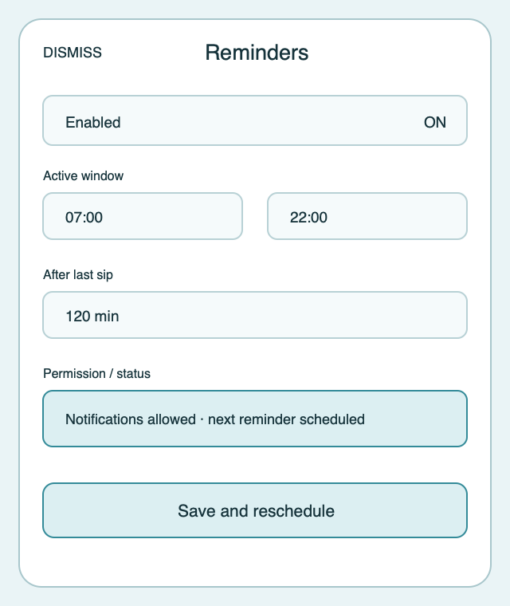

# Ripple Surface — Edit reminders

**Stable surface ID:** `edit-reminder`
**Surface contract version:** 1.1.1
**Last verified:** 2026-09-23
**Kind:** Sheet
**Localized name:** `Erinnerungen bearbeiten` / `Edit reminders`

This is the canonical description of reminder configuration.

## Purpose and user outcome

The user configures when hydration reminders are enabled and how often they
occur, without changing hydration history or local logging capability.

## Entry and exit

The sheet opens from Settings → Reminders. Cancel/back/dismissal discards the
draft. Save persists the rule and invokes `RescheduleReminders` before
returning to Settings. Turning reminders off cancels future notifications but
does not delete the rule or history.

## Layout and region order

1. Dismiss/cancel action and title.
2. Enabled control.
3. Start and end times.
4. Reminder interval or after-last-sip value.
5. Permission/status explanation.
6. Inline validation.
7. Primary Save action.

The exact control type is platform-native, but labels, current values, units,
and enabled state remain visible and ordered.

## Reference evidence and visible-element inventory

**Reference set:** [shared edit-reminder wireframe](../wireframes/edit-reminder--ready--compact.png); no runtime capture is currently designated
**Reference classification:** Current shared semantic wireframe.
**States/viewports inspected:** Ready compact, permission denied/unavailable, scheduling error, and large-text sheet.
**System-owned chrome excluded from the shared wireframe:** Native time pickers, toggle, permission surface, and sheet dismissal chrome.

**Required product-owned composition:** Dismiss/title; enabled state; start/end times; interval/after-last-sip value with unit; permission/status; validation; Save/reschedule.

The complete element-by-element inventory, reference identity, crop/state notes,
and reconciliation decisions are maintained in the [Ripple visual reference
inventory](../Ripple_VISUAL_REFERENCE_INVENTORY.md#edit-reminder). The linked
review note is part of this surface contract; it does not authorize behavior
outside the PRD or replace the native platform mapping.

## Platform-independent wireframes

Editable source: [edit-reminder--ready--compact.svg](../wireframes/edit-reminder--ready--compact.svg).

Caption: Representative ready state in the compact semantic viewport; shared surface contract version 1.1.1. The neutral illustration shows hierarchy only and does not prescribe native navigation or control appearance.

## Read model and draft

Read `ReminderRule`, profile reminder preference, notification authorization
status, local time zone, and relevant sync status. Draft changes remain local
until Save.

## Actions and domain operations

| User action | Operation | Result |
|---|---|---|
| Change enabled/times/interval | Local draft update | Validate locally and update the visible summary. |
| Request notification access | `RequestNotificationAuthorization` | Invoke the platform flow and re-read authorization on return. |
| Save valid rule | `RescheduleReminders` | Persist the rule, schedule/cancel future reminders, and return to Settings. |
| Cancel/dismiss | None | Discard the draft. |

## States

- **Loading:** Keep title and field shells stable.
- **Ready:** Show current rule and enabled state.
- **Invalid:** Disable Save and explain invalid time/interval combinations.
- **Permission denied/unavailable:** Keep the rule visible, mark scheduling
  unavailable, and explain that local logging remains usable.
- **Scheduling error:** Keep the saved rule and show recoverable status.
- **Success:** Refresh Settings reminder summary.
- **Reduced motion:** Use no decorative transition.

## Validation and destructive behavior

Start/end/interval values must be valid in the local time zone and obey the
documented minimums. Disabling reminders cancels future notifications only.
There is no delete action on this surface.

## Accessibility and large text

Native time, numeric, toggle, and Save controls announce labels, current
values, units, and enabled state. Permission explanation is associated with
the request action. Large text may increase sheet height; it must not hide Save
or make the permission status depend on color alone.

## Design tokens and reusable elements

Use `GlassCard`, `SyncStatusView`, native time/numeric/toggle controls, and
shared type, color, spacing, and motion tokens from
[`../Ripple_DESIGN_SYSTEM.md`](../Ripple_DESIGN_SYSTEM.md).

## Responsive/platform-independent behavior

Fields can stack on compact surfaces and group related values on expanded
surfaces. The semantic order enabled → schedule → permission/status → Save is
preserved. System notification settings remain system-owned.

## Forbidden behavior

- Mutating hydration history.
- Treating denied notification permission as a failed hydration log.
- Scheduling from view code without `RescheduleReminders`.
- Hiding invalid values without actionable explanation.
- Deleting the reminder rule as a side effect of turning it off.

## Timeline

| Version | Date | Change | Impact |
|---|---|---|---|
| 1.0.0 | 2026-09-11 | Established the canonical platform-independent Edit reminders description. | iOS and Android share one semantic surface outcome and action boundary. |
| 1.1.0 | 2026-09-18 | Added the shared ready-state wireframe and verified the contract against the Apple 1.1 baseline. | Android receives a current neutral layout reference without replacing native controls or runtime evidence. |

| 1.1.1 | 2026-09-23 | Added current-reference classification and a linked visible-element inventory for this surface. | Product-owned regions, state/viewport coverage, and system-chrome exclusions are traceable for the cross-platform handoff. |

## Related contracts

- [`../Ripple_PRD.md`](../Ripple_PRD.md)
- [`../Ripple_SCREEN_CATALOG.md`](../Ripple_SCREEN_CATALOG.md)
- [`../Ripple_DESIGN_SYSTEM.md`](../Ripple_DESIGN_SYSTEM.md)
- [`../Ripple_DATA_MODEL.md`](../Ripple_DATA_MODEL.md)
- [`../IOS_ARCHITECTURE.md`](../IOS_ARCHITECTURE.md)
- [`../Android/ANDROID_ARCHITECTURE.md`](../Android/ANDROID_ARCHITECTURE.md)
- [`../Android/ANDROID_UI_SPEC.md`](../Android/ANDROID_UI_SPEC.md)
- [`settings.md`](settings.md)
