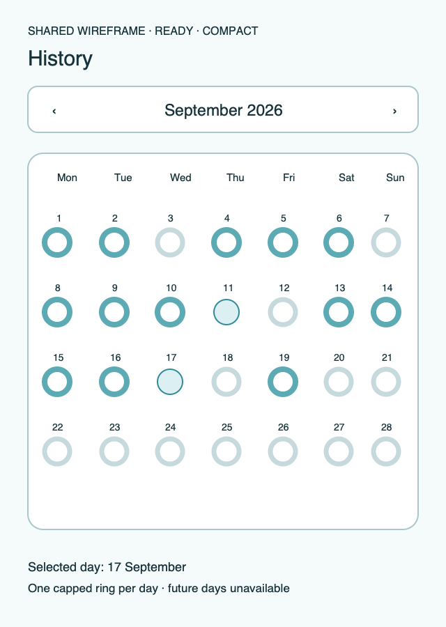
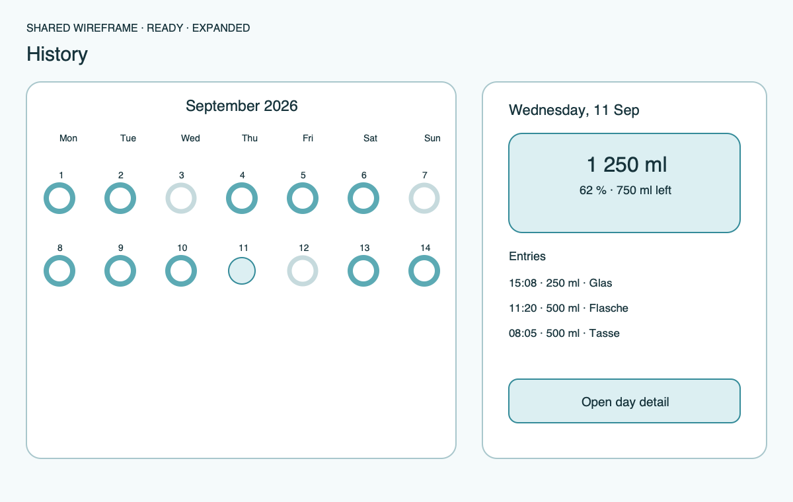

# Ripple Surface — History

**Stable surface ID:** `history`  
**Surface contract version:** 1.1.0
**Last verified:** 2026-09-18
**Kind:** Root screen  
**Localized name:** `Verlauf` / `History`

This is the canonical description of the month-based History surface.

## Purpose and user outcome

The user understands hydration by day across a calendar month and can open an
allowed day for entry-level detail. History is activity-oriented and is not a
recent-entry feed or a Stats replacement.

## Entry and exit

History opens from root navigation. Month navigation stays on this surface.
Selecting today or a past day opens [`day-detail.md`](day-detail.md). Future
days are visible but inactive. The surface does not edit data directly.

## Layout and region order

1. Month/date navigation and localized month title.
2. Weekday labels.
3. A month grid with one capped progress ring or equivalent day marker per
   calendar day.
4. A legend or summary explaining goal status and the selected day.
5. Platform root navigation outside the feature content.

The calendar is the primary content. A regular or expanded presentation may
reserve a persistent detail region after a day is selected, but the semantic
route remains History → Day Detail.

## Platform-independent wireframes

Editable source: [history--ready--compact.svg](../wireframes/history--ready--compact.svg).

Caption: Representative ready state in the compact semantic viewport; shared surface contract version 1.1.0. The neutral illustration shows hierarchy only and does not prescribe native navigation or control appearance.

Editable source: [history--ready--expanded.svg](../wireframes/history--ready--expanded.svg).

Caption: Representative ready state in the compact semantic viewport; shared surface contract version 1.1.0. The neutral illustration shows hierarchy only and does not prescribe native navigation or control appearance.

## Read model

Use `HistorySnapshot` for the requested local calendar month, with one
`DayTotal` per day and the entries needed when a day is selected. A day total
contains consumed amount, goal context, percentage, and status. Future days
are identified from the current local date, not from a server timestamp.

## Actions and domain operations

| User action | Operation | Result |
|---|---|---|
| Change month | `ObserveMonth` | Replace the month snapshot and announce the new localized month. |
| Select today or a past day | `ObserveHistory` for the selected day / open `day-detail` | Preserve date context and show the day detail surface. |
| Select a future day | None | Keep the calendar unchanged and announce that the day is unavailable. |
| Change root section | Platform-local navigation | Preserve the current month selection where lifecycle permits. |

## States

- **Loading:** Keep month header and calendar frame stable and announce loading.
- **Empty month:** Render every calendar day with zero progress and useful
  empty copy; do not invent bars or rings.
- **Ready:** Render one marker per day, capped at 100 percent.
- **Future:** Disable and do not activate future days.
- **Offline/sync unavailable:** Keep cached local data readable and show status
  inline.
- **Error:** Explain the unavailable month and provide retry.
- **Reduced motion:** Avoid ring-spin or calendar-introduction choreography.

## Validation and destructive behavior

No future day is actionable. History does not edit, delete, or create entries.
All mutations belong to Day Detail or Edit Intake. Progress is visualized as a
cap, but actual consumed values remain available to detail and accessibility.

## Accessibility and large text

Each day announces localized date, consumed amount, goal, percentage, and goal
status. Future days announce unavailable. Calendar reading order is
chronological; changing month announces the new month. The ring/marker is never
the only indication of progress. Large text may enlarge day cells or reflow
the legend but may not remove date or amount information.

## Design tokens and reusable elements

Use `DayHeader`, `DayRing`, `GlassCard`, `EmptyState`, and `SyncStatusView`.
All colors, type, spacing, shapes, and motion come from
[`../Ripple_DESIGN_SYSTEM.md`](../Ripple_DESIGN_SYSTEM.md).

## Responsive/platform-independent behavior

Compact layouts use one month grid. Regular or expanded layouts may show the
calendar beside a selected detail region. Wearable History is a separate
seven-day surface and never becomes a month grid through scaling.

## Forbidden behavior

- A recent-entry list as the primary History surface.
- A GitHub-style heatmap or three fitness rings.
- A combined History and Stats destination.
- Tappable future days.
- Chart or day-total truth sourced from a projection instead of the domain.

## Timeline

| Version | Date | Change | Impact |
|---|---|---|---|
| 1.0.0 | 2026-09-11 | Established the canonical platform-independent History description. | iOS and Android share one semantic surface outcome and action boundary. |
| 1.1.0 | 2026-09-18 | Added the shared ready-state wireframes and verified the contract against the Apple 1.1 baseline. | Android receives a current neutral layout reference without replacing native controls or runtime evidence. |

## Related contracts

- [`../Ripple_PRD.md`](../Ripple_PRD.md)
- [`../Ripple_SCREEN_CATALOG.md`](../Ripple_SCREEN_CATALOG.md)
- [`../Ripple_DESIGN_SYSTEM.md`](../Ripple_DESIGN_SYSTEM.md)
- [`../Ripple_DATA_MODEL.md`](../Ripple_DATA_MODEL.md)
- [`../IOS_ARCHITECTURE.md`](../IOS_ARCHITECTURE.md)
- [`../Android/ANDROID_ARCHITECTURE.md`](../Android/ANDROID_ARCHITECTURE.md)
- [`../Android/ANDROID_UI_SPEC.md`](../Android/ANDROID_UI_SPEC.md)
- [`day-detail.md`](day-detail.md)
