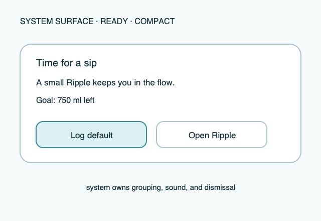

# Ripple Surface — Notification actions

**Stable surface ID:** `notification-actions`  
**Surface contract version:** 1.1.0
**Last verified:** 2026-09-18
**Kind:** System surface  
**Localized name:** Localized reminder/action copy

This is the canonical contract for actions attached to a Ripple reminder
notification.

## Purpose and user outcome

The user can log a configured amount directly from a reminder or open the
relevant app entry surface. The reminder never becomes a second app shell.

## Entry and exit

The operating system presents the notification. A log action resolves its
configured amount and calls `LogIntake` with source `notification`; an open
action routes to Today or custom amount. The system dismisses or updates the
notification according to its own lifecycle.

## Layout and region order

Use the system notification template with localized title/body, remaining or
goal context where useful, one clear predefined log action, and an open-app
action when available. Do not place a calendar, Stats chart, or complex editor
inside the notification.

## Platform-independent wireframes

Editable source: [notification-actions--ready--compact.svg](../wireframes/notification-actions--ready--compact.svg).

Caption: Representative ready state in the compact semantic viewport; shared surface contract version 1.1.0. The neutral illustration shows hierarchy only and does not prescribe native navigation or control appearance.

## Read model

The scheduler reads the current reminder rule and a snapshot sufficient for
localized copy.

## Actions and domain operations

The action adapter calls `LogIntake` or opens the canonical app
surface. It never writes intake storage directly or duplicates amount
resolution.

## States

An invalid/disabled reminder produces no action or a clear unavailable state.
Success reports the amount logged. Projection failure is reported by the
system/app feedback while a stored local log remains authoritative. Permission
denial affects scheduling, not local logging.

## Validation and destructive behavior

An action is offered only when its configured amount resolves to a positive
valid value. Notification actions have no destructive mutation; dismissal is
owned by the operating system.

## Accessibility and large text

Action labels state amount, unit, and result. The system controls grouping,
priority, dismissal, sound, and accessibility presentation. Ripple supplies
localized semantic copy and preserves the system's notification affordances.

## Design tokens and reusable elements

Use shared copy, amount formatting, status, and accessibility roles from
[`../Ripple_DESIGN_SYSTEM.md`](../Ripple_DESIGN_SYSTEM.md); the system owns
notification chrome.

## Responsive/platform-independent behavior

The host may change notification width, grouping, and action placement while
keeping title → context → log/open action priority.

## Forbidden behavior

No second persistence path, silent logging, medical claims, or notification
that requires a hidden app state is allowed.

## Timeline

| Version | Date | Change | Impact |
|---|---|---|---|
| 1.0.0 | 2026-09-11 | Established the canonical platform-independent Notification actions description. | iOS and Android share one semantic surface outcome and action boundary. |
| 1.1.0 | 2026-09-18 | Added the shared ready-state wireframe and verified the contract against the Apple 1.1 baseline. | Android receives a current neutral layout reference without replacing native controls or runtime evidence. |

## Related contracts

- [`../Ripple_PRD.md`](../Ripple_PRD.md)
- [`../Ripple_SCREEN_CATALOG.md`](../Ripple_SCREEN_CATALOG.md)
- [`../Ripple_DESIGN_SYSTEM.md`](../Ripple_DESIGN_SYSTEM.md)
- [`../Ripple_DATA_MODEL.md`](../Ripple_DATA_MODEL.md)
- [`../IOS_ARCHITECTURE.md`](../IOS_ARCHITECTURE.md)
- [`../Android/ANDROID_ARCHITECTURE.md`](../Android/ANDROID_ARCHITECTURE.md)
- [`../Android/ANDROID_UI_SPEC.md`](../Android/ANDROID_UI_SPEC.md)
- [`edit-reminder.md`](edit-reminder.md)
- [`today.md`](today.md)
