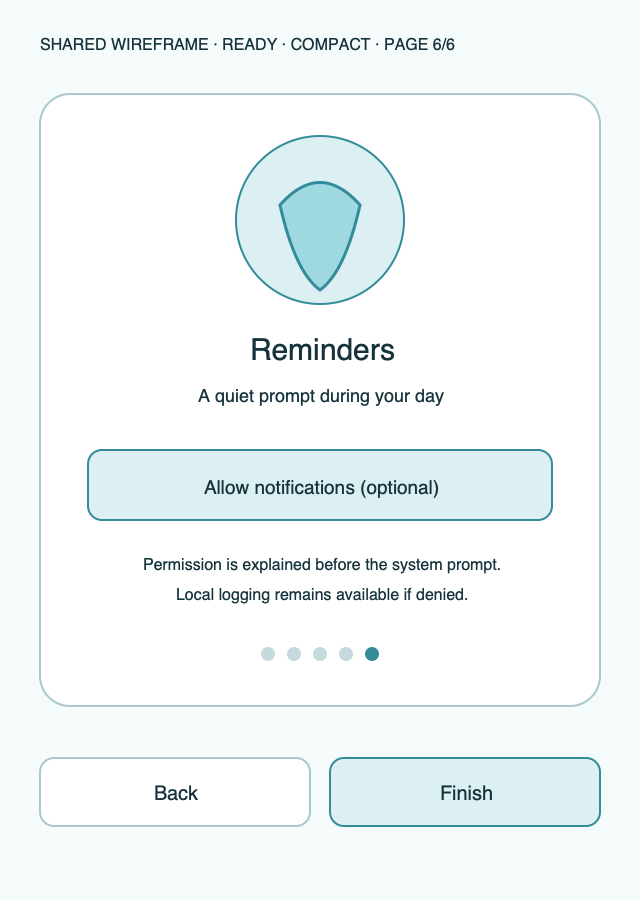

# Ripple Surface — Onboarding

**Stable surface ID:** `onboarding`
**Surface contract version:** 1.1.1
**Last verified:** 2026-09-23
**Kind:** Onboarding surface
**Localized name:** Localized onboarding copy; no fixed single title required

This is the canonical description of first-run setup.

## Purpose and user outcome

The user understands Ripple, configures minimum local profile/goal behavior,
and can optionally request system permissions without losing the ability to
log locally when permissions are denied or deferred.

## Entry and exit

Onboarding appears before the main root while completion is false. The user can
advance, go back, skip optional education/permission handoffs, and finish. On
completion, persist `onboardingCompleted` through `UpdateProfile` and open
Today. Re-entering onboarding/settings must not duplicate containers or
reminders.

## Layout and region order

Each page uses the same semantic order:

1. Page/progress context.
2. Secondary illustration or explanatory content.
3. Local inputs or permission explanation when required.
4. Primary Next/Finish action.
5. Secondary Back/Skip action.

The six-page sequence is Welcome, Units, Health, Goal, Containers, and
Reminders. Artwork is subordinate to copy and controls.

## Reference evidence and visible-element inventory

**Reference set:** [Android phone onboarding](../Android/UI/phone-onboarding.png) and [shared onboarding wireframe](../wireframes/onboarding--ready--compact.png); no Apple runtime capture
**Reference classification:** Android supporting evidence plus current shared semantic wireframe.
**States/viewports inspected:** First-run compact six-page sequence, permission pending/denied, and large-text pages.
**System-owned chrome excluded from the shared wireframe:** Native Health/notification permission dialogs and host status/navigation chrome.

**Required product-owned composition:** Page/progress context; page-specific copy/illustration and unit/health/goal/container/reminder content; permission explanation; Back/Skip where allowed; Next/Finish.

The complete element-by-element inventory, reference identity, crop/state notes,
and reconciliation decisions are maintained in the [Ripple visual reference
inventory](../Ripple_VISUAL_REFERENCE_INVENTORY.md#onboarding). The linked
review note is part of this surface contract; it does not authorize behavior
outside the PRD or replace the native platform mapping.

## Platform-independent wireframes

Editable source: [onboarding--ready--compact.svg](../wireframes/onboarding--ready--compact.svg).

Caption: Representative ready state in the compact semantic viewport; shared surface contract version 1.1.1. The neutral illustration shows hierarchy only and does not prescribe native navigation or control appearance.

## Read model

Read fresh `Profile`, `GoalSettings`, current authorization statuses, locale,
and the PRD-defined six-page sequence. Local drafts persist only when their
page/use case explicitly commits them.

## Actions and domain operations

| User action | Operation | Result |
|---|---|---|
| Set unit/profile/goal | `UpdateProfile`, `UpdateGoal`, or `CalculateGoal` | Persist the local setup value and continue. |
| Request health access | `RequestHealthOnboardingAccess` or the relevant permission use case | Open system permission flow; denial keeps onboarding usable. |
| Request notifications | `RequestNotificationAuthorization` | Open system permission flow and re-read status on return. |
| Skip optional page | None | Continue without permission or optional setting. |
| Finish | `UpdateProfile` with completion flag | Mark onboarding complete and enter Today. |

## States

- **Permission resolving:** Keep page content usable while authorization state
  is read.
- **Ready:** Every page can advance without optional access.
- **Denied/deferred:** Explain how to continue and what remains optional.
- **Scoped error:** Keep local setup usable and identify the affected request.
- **Success:** Enter Today with persisted local settings.
- **Reduced motion:** Cross-fade page changes without decorative motion.

## Validation and destructive behavior

Required local settings must be valid before Finish. Optional permission denial
never blocks local logging. Completion is not persisted before the required
local values are successfully stored. Onboarding has no destructive delete.

## Accessibility and large text

Announce page number/progress, purpose, current input, and next action. Focus
starts at the page title and moves to the primary action. Permission pages say
explicitly that denial does not prevent local logging. Large text may expand a
page and move actions lower but must not clip copy or hide Next/Finish.

## Design tokens and reusable elements

Use `OnboardingArtwork`, `GlassCard`, native text/selection controls, primary
actions, and the shared type, color, spacing, shape, and motion tokens from
[`../Ripple_DESIGN_SYSTEM.md`](../Ripple_DESIGN_SYSTEM.md).

## Responsive/platform-independent behavior

Content remains readable in compact, regular, expanded, wearable, and windowed
contexts. The platform may change page navigation chrome and permission
presentation, but the six-page information order and optionality remain.

## Forbidden behavior

- Blocking local logging on optional permission denial.
- Marking onboarding complete before required local settings are persisted.
- Inventing medical claims.
- Duplicating seeded containers or reminders on re-entry.
- Making artwork or color the only source of page meaning.

## Timeline

| Version | Date | Change | Impact |
|---|---|---|---|
| 1.0.0 | 2026-09-11 | Established the canonical platform-independent Onboarding description. | iOS and Android share one semantic surface outcome and action boundary. |
| 1.1.0 | 2026-09-18 | Added the shared ready-state wireframe and verified the contract against the Apple 1.1 baseline. | Android receives a current neutral layout reference without replacing native controls or runtime evidence. |

| 1.1.1 | 2026-09-23 | Added current-reference classification and a linked visible-element inventory for this surface. | Product-owned regions, state/viewport coverage, and system-chrome exclusions are traceable for the cross-platform handoff. |

## Related contracts

- [`../Ripple_PRD.md`](../Ripple_PRD.md)
- [`../Ripple_SCREEN_CATALOG.md`](../Ripple_SCREEN_CATALOG.md)
- [`../Ripple_DESIGN_SYSTEM.md`](../Ripple_DESIGN_SYSTEM.md)
- [`../Ripple_DATA_MODEL.md`](../Ripple_DATA_MODEL.md)
- [`../IOS_ARCHITECTURE.md`](../IOS_ARCHITECTURE.md)
- [`../Android/ANDROID_ARCHITECTURE.md`](../Android/ANDROID_ARCHITECTURE.md)
- [`../Android/ANDROID_UI_SPEC.md`](../Android/ANDROID_UI_SPEC.md)
