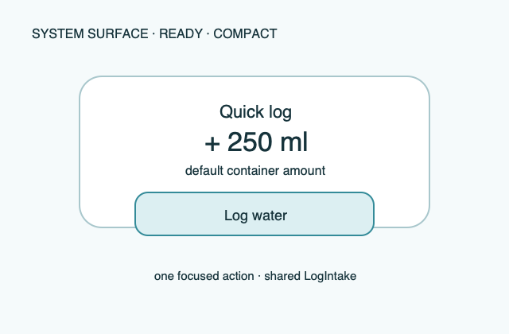

# Ripple Surface — Quick-log control

**Stable surface ID:** `quick-log-control`  
**Surface contract version:** 1.1.0
**Last verified:** 2026-09-18
**Kind:** System surface  
**Localized name:** Platform-local control name

This is the canonical contract for a focused operating-system quick-log
control.

## Purpose and user outcome

The user logs one focused predefined amount from a system control without
opening the full app.

## Entry and exit

The system invokes the control adapter. The adapter resolves the configured
default/container amount through shared domain policy, calls `LogIntake`, and
returns a concise success/error result to the system surface. More complex
selection opens the app's custom amount surface when supported.

## Layout and region order

The system controls the host chrome. Ripple supplies only the localized action
label, amount/container meaning, state/result, and optional focused icon.

## Platform-independent wireframes

Editable source: [quick-log-control--ready--compact.svg](../wireframes/quick-log-control--ready--compact.svg).

Caption: Representative ready state in the compact semantic viewport; shared surface contract version 1.1.0. The neutral illustration shows hierarchy only and does not prescribe native navigation or control appearance.

## Read model

Read the current effective default or explicitly configured quick amount.

## Actions and domain operations

The only mutation is `LogIntake` with source `control`. A local store/projection
failure is reported independently; the control must not create a second log
path.

## States

The action is unavailable when no valid positive amount can be resolved. Ready
shows the amount/unit. Success reports the stored amount. Permission or sync
failure does not erase or roll back a stored local log. Reduced motion is
irrelevant to the static control result.

## Validation and destructive behavior

The resolved amount must be positive and valid for the current unit/default
policy. The control has no destructive action.

## Accessibility and large text

The system control announces action, amount, unit, and result. Its host may
change size or placement; the semantic action remains one focused log.

## Design tokens and reusable elements

Use the shared amount, icon, label, and accessibility roles from
[`../Ripple_DESIGN_SYSTEM.md`](../Ripple_DESIGN_SYSTEM.md). Preserve the
operating system's control, focus, hit target, and permission behavior.

## Responsive/platform-independent behavior

The host may change size, placement, or invocation gesture; the action remains
one focused log with an amount and unit.

## Forbidden behavior

- Duplicate amount logic in the control adapter.
- Direct storage writes outside `LogIntake`.
- A hidden or ambiguous default amount.
- A full dashboard, calendar, or Stats chart in the control.

## Timeline

| Version | Date | Change | Impact |
|---|---|---|---|
| 1.0.0 | 2026-09-11 | Established the canonical platform-independent Quick-log control description. | iOS and Android share one semantic surface outcome and action boundary. |
| 1.1.0 | 2026-09-18 | Added the shared ready-state wireframe and verified the contract against the Apple 1.1 baseline. | Android receives a current neutral layout reference without replacing native controls or runtime evidence. |

## Related contracts

- [`../Ripple_PRD.md`](../Ripple_PRD.md)
- [`../Ripple_SCREEN_CATALOG.md`](../Ripple_SCREEN_CATALOG.md)
- [`../Ripple_DESIGN_SYSTEM.md`](../Ripple_DESIGN_SYSTEM.md)
- [`../Ripple_DATA_MODEL.md`](../Ripple_DATA_MODEL.md)
- [`../IOS_ARCHITECTURE.md`](../IOS_ARCHITECTURE.md)
- [`../Android/ANDROID_ARCHITECTURE.md`](../Android/ANDROID_ARCHITECTURE.md)
- [`../Android/ANDROID_UI_SPEC.md`](../Android/ANDROID_UI_SPEC.md)
- [`settings.md`](settings.md)
