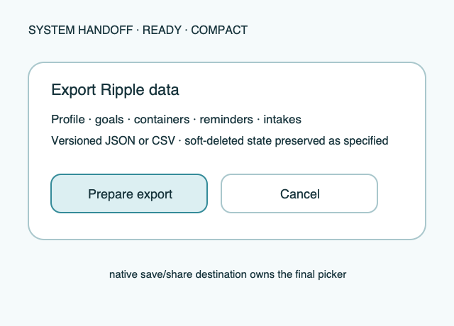

# Ripple Surface — Share/export

**Stable surface ID:** `share-export`
**Surface contract version:** 1.1.1
**Last verified:** 2026-09-23
**Kind:** System surface
**Localized name:** Platform-local share/export copy

This is the canonical contract for exporting Ripple data through the operating
system's file/share flow.

## Purpose and user outcome

The user receives a complete, versioned export of the permitted Ripple data and
can save or share it using the system's native destination picker.

## Entry and exit

Export starts from Settings or an equivalent system entry. `ExportData` builds
the payload; after successful creation the system-owned share/save flow opens.
Cancel returns without domain mutation. Export errors retain Settings context
and offer retry.

## Layout and region order

1. Export description and scope.
2. Preparation/progress or error status.
3. Primary system share/save action.
4. Cancel/dismissal owned by the system.

## Reference evidence and visible-element inventory

**Reference set:** [shared share/export wireframe](../wireframes/share-export--ready--compact.png); no runtime capture is currently designated
**Reference classification:** Current shared system-handoff illustration.
**States/viewports inspected:** Ready, preparing, empty-but-valid, error/retry, and success handoff.
**System-owned chrome excluded from the shared wireframe:** Native save/share destination, file permission prompts, and host picker chrome.

**Required product-owned composition:** Export scope and versioned JSON/CSV formats; preparation/status; primary prepare/export action; native save/share handoff; cancel without mutation.

The complete element-by-element inventory, reference identity, crop/state notes,
and reconciliation decisions are maintained in the [Ripple visual reference
inventory](../Ripple_VISUAL_REFERENCE_INVENTORY.md#share-export). The linked
review note is part of this surface contract; it does not authorize behavior
outside the PRD or replace the native platform mapping.

## Platform-independent wireframes

Editable source: [share-export--ready--compact.svg](../wireframes/share-export--ready--compact.svg).

Caption: Representative ready state in the compact semantic viewport; shared surface contract version 1.1.1. The neutral illustration shows hierarchy only and does not prescribe native navigation or control appearance.

## Read model

The export contains the documented profile, goals, containers, reminders, and
intake rows, including soft-deleted state where required for reconciliation.
It is versioned, localized where user-facing labels are included, and uses
integer milliliters as the canonical amount. The public contract never exposes
raw database files or internal storage schema.

## Actions and domain operations

`ExportData` builds the versioned payload; successful preparation opens the
system-owned share/save flow. Cancel performs no domain mutation.

## States

Loading explains that export is being prepared. Ready offers the system share/
save action. Empty data still produces a valid versioned payload. Error states
identify preparation or destination failure and offer retry. No permission or
sync projection failure may silently alter the payload's domain truth.

## Validation and destructive behavior

The payload must be complete, versioned, and valid for the export schema. The
surface has no destructive action and never deletes data during export.

## Accessibility and large text

The action announces what will be exported, file format/version, and result.
The system owns destination selection, share targets, cancellation, and file
permissions. Ripple supplies localized filename, description, and semantic
status.

## Design tokens and reusable elements

Use Settings action, status, copy, type, and accessibility contracts from
[`../Ripple_DESIGN_SYSTEM.md`](../Ripple_DESIGN_SYSTEM.md). Forbidden: deleting
## Responsive/platform-independent behavior

The system may present a centered, side-aligned, or host-specific destination
flow; export scope → status → share/save remains the semantic order.

## Forbidden behavior

Deleting data during export, exposing raw store files, inventing a second
export format without versioning, or replacing the native destination flow
with a fake app screen is forbidden.

## Timeline

| Version | Date | Change | Impact |
|---|---|---|---|
| 1.0.0 | 2026-09-11 | Established the canonical platform-independent Share/export description. | iOS and Android share one semantic surface outcome and action boundary. |
| 1.1.0 | 2026-09-18 | Added the shared ready-state wireframe and verified the contract against the Apple 1.1 baseline. | Android receives a current neutral layout reference without replacing native controls or runtime evidence. |

| 1.1.1 | 2026-09-23 | Added current-reference classification and a linked visible-element inventory for this surface. | Product-owned regions, state/viewport coverage, and system-chrome exclusions are traceable for the cross-platform handoff. |

## Related contracts

- [`../Ripple_PRD.md`](../Ripple_PRD.md)
- [`../Ripple_SCREEN_CATALOG.md`](../Ripple_SCREEN_CATALOG.md)
- [`../Ripple_DESIGN_SYSTEM.md`](../Ripple_DESIGN_SYSTEM.md)
- [`../Ripple_DATA_MODEL.md`](../Ripple_DATA_MODEL.md)
- [`../IOS_ARCHITECTURE.md`](../IOS_ARCHITECTURE.md)
- [`../Android/ANDROID_ARCHITECTURE.md`](../Android/ANDROID_ARCHITECTURE.md)
- [`../Android/ANDROID_UI_SPEC.md`](../Android/ANDROID_UI_SPEC.md)
- [`settings.md`](settings.md)
