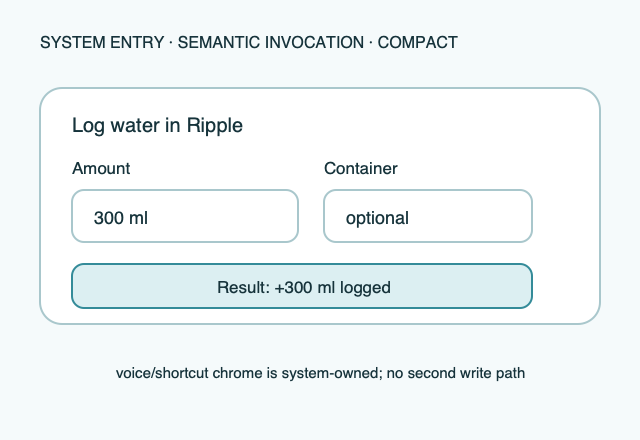

# Ripple Surface — Shortcuts and intents

**Stable surface ID:** `shortcuts-and-intents`
**Surface contract version:** 1.1.1
**Last verified:** 2026-09-23
**Kind:** System surface
**Localized name:** Localized shortcut/action name

This is the canonical contract for voice, shortcut, and system-intent entry
points.

## Purpose and user outcome

The user can discover and invoke localized Ripple logging actions with a
predefined amount or a selected saved container, receive a concise result, and
continue without learning a second amount model.

## Entry and exit

The system invokes an intent/action adapter. The adapter validates parameters,
resolves any container amount through shared policy, calls `LogIntake` with
source `intent`, and returns a localized result. Invalid or incomplete input
returns an actionable error or opens the app's canonical entry surface when
the system supports continuation.

## Layout and region order

The system presents a localized action name, supported parameters, confirmation
or error result, and an optional route into the app. System voice/shortcut
chrome remains outside Ripple's surface description.

## Reference evidence and visible-element inventory

**Reference set:** [shared shortcut/intent wireframe](../wireframes/shortcuts-and-intents--ready--compact.png); no runtime capture is currently designated
**Reference classification:** Current shared semantic invocation illustration.
**States/viewports inspected:** Ready, validation, success, and error.
**System-owned chrome excluded from the shared wireframe:** Voice assistant, shortcut editor, invocation shell, and host confirmation chrome.

**Required product-owned composition:** Amount/unit parameter; optional container parameter; localized result naming amount/source; error/recovery status; one shared LogIntake boundary.

The complete element-by-element inventory, reference identity, crop/state notes,
and reconciliation decisions are maintained in the [Ripple visual reference
inventory](../Ripple_VISUAL_REFERENCE_INVENTORY.md#shortcuts-and-intents). The linked
review note is part of this surface contract; it does not authorize behavior
outside the PRD or replace the native platform mapping.

## Platform-independent wireframes

Editable source: [shortcuts-and-intents--ready--compact.svg](../wireframes/shortcuts-and-intents--ready--compact.svg).

Caption: Representative ready state in the compact semantic viewport; shared surface contract version 1.1.1. The neutral illustration shows hierarchy only and does not prescribe native navigation or control appearance.

## Read model

Expose only supported localized parameters: amount/unit, optional container,
and any explicitly documented date/source restriction. Integer milliliters are
the domain value.

## Actions and domain operations

Every successful invocation uses `LogIntake`; there is no intent-specific
persistence or goal calculation.

## States

Validate positive amount, supported unit conversion, and selected container
identity before mutation. Success returns amount, unit, and source context.
Projection failure does not roll back local persistence. Unsupported access or
permission produces a localized explanation. Reduced motion has no effect on
the concise result.

## Validation and destructive behavior

Positive amount, supported unit conversion, and selected-container identity are
required. This surface has no destructive action.

## Accessibility and large text

Names, parameters, examples, and errors are localized in DE and EN. Spoken or
assistive results include amount, unit, and outcome. The action remains
discoverable without relying on an icon alone.

## Design tokens and reusable elements

Use the shared unit converter, amount formatting, container entity, copy, and
accessibility roles from [`../Ripple_DESIGN_SYSTEM.md`](../Ripple_DESIGN_SYSTEM.md)
and [`../Ripple_DATA_MODEL.md`](../Ripple_DATA_MODEL.md). The system owns
voice/shortcut chrome and confirmation presentation.

## Responsive/platform-independent behavior

The system may change parameter presentation for voice, shortcut, or compact
contexts; amount → confirmation/error remains the semantic order.

## Forbidden behavior

- A second `LogIntake` implementation or amount formula.
- An unlocalized phrase or error.
- Silent success when local persistence failed.
- A shortcut that exposes Health/projection data as logging truth.

## Timeline

| Version | Date | Change | Impact |
|---|---|---|---|
| 1.0.0 | 2026-09-11 | Established the canonical platform-independent Shortcuts and intents description. | iOS and Android share one semantic surface outcome and action boundary. |
| 1.1.0 | 2026-09-18 | Added the shared ready-state wireframe and verified the contract against the Apple 1.1 baseline. | Android receives a current neutral layout reference without replacing native controls or runtime evidence. |

| 1.1.1 | 2026-09-23 | Added current-reference classification and a linked visible-element inventory for this surface. | Product-owned regions, state/viewport coverage, and system-chrome exclusions are traceable for the cross-platform handoff. |

## Related contracts

- [`../Ripple_PRD.md`](../Ripple_PRD.md)
- [`../Ripple_SCREEN_CATALOG.md`](../Ripple_SCREEN_CATALOG.md)
- [`../Ripple_DESIGN_SYSTEM.md`](../Ripple_DESIGN_SYSTEM.md)
- [`../Ripple_DATA_MODEL.md`](../Ripple_DATA_MODEL.md)
- [`../IOS_ARCHITECTURE.md`](../IOS_ARCHITECTURE.md)
- [`../Android/ANDROID_ARCHITECTURE.md`](../Android/ANDROID_ARCHITECTURE.md)
- [`../Android/ANDROID_UI_SPEC.md`](../Android/ANDROID_UI_SPEC.md)
- [`today.md`](today.md)
