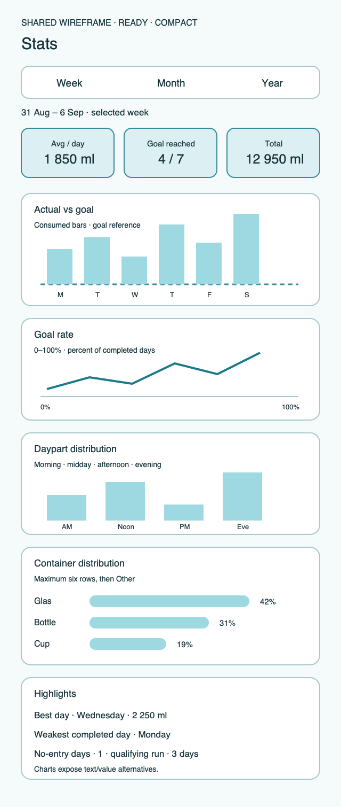
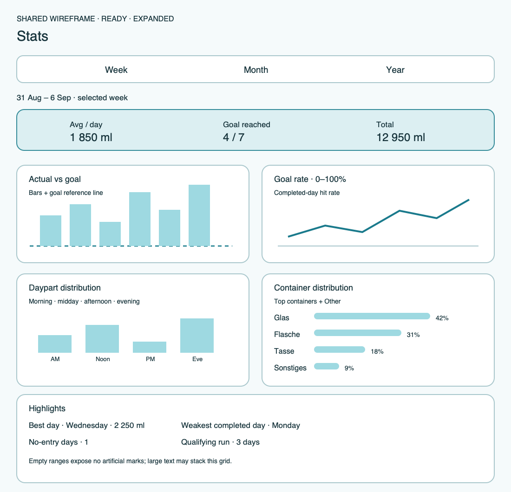

# Ripple Surface — Stats

**Stable surface ID:** `stats`
**Surface contract version:** 1.1.3
**Last verified:** 2026-09-23
**Kind:** Root screen
**Localized name:** `Statistik` / `Stats`

This is the canonical description of the period-based Stats surface.

## Purpose and user outcome

The user understands hydration totals and patterns for a selected week, month,
or year. Stats is a focused analysis surface, not a streak, social, or
combined History destination.

## Entry and exit

Stats opens from root navigation. Changing the period updates this surface;
chart selection reveals detail without changing destination. Stats has no write
operation. Moving to another root preserves the chosen period when the platform
lifecycle allows it.

## Layout and region order

1. Period selector: week, month, or year.
2. Summary metrics.
3. Daily progress chart.
4. Goal-quote or goal-attainment chart.
5. Daypart distribution chart.
6. Container distribution chart.
7. Highlights and localized explanatory summaries.
8. Empty, sync, or error feedback.

Charts may stack or form columns responsively, but the semantic order and
separation from History remain clear.

## Reference evidence and visible-element inventory

**Reference set:** [iPhone Stats](ios/iphone-stats.png), [Android phone Stats](../Android/UI/phone-stats.png), [Android tablet Stats](../Android/UI/tablet-stats.png), and [shared compact/expanded wireframes](../wireframes/stats--ready--compact.png)
**Reference classification:** iOS current visual evidence, Android layout evidence, and shared semantic target; the iPhone capture is vertically cropped.
**States/viewports inspected:** Week compact, expanded adaptive grid, month/year, empty, and large-text fallback.
**System-owned chrome excluded from the shared wireframe:** Status bar, root navigation, and native selector/picker chrome.

**Required product-owned composition:** Period selector plus dependent date/range context; three summary metrics; four distinct chart families (actual vs goal, goal rate, daypart, containers); dedicated highlights; empty/error text and chart value alternatives.

The complete element-by-element inventory, reference identity, crop/state notes,
and reconciliation decisions are maintained in the [Ripple visual reference
inventory](../Ripple_VISUAL_REFERENCE_INVENTORY.md#stats). The linked
review note is part of this surface contract; it does not authorize behavior
outside the PRD or replace the native platform mapping.

## Platform-independent wireframes

Editable source: [stats--ready--compact.svg](../wireframes/stats--ready--compact.svg).

Caption: Representative ready state in the compact semantic viewport; shared surface contract version 1.1.3. The neutral illustration shows hierarchy only and does not prescribe native navigation or control appearance.

Editable source: [stats--ready--expanded.svg](../wireframes/stats--ready--expanded.svg).

Caption: Representative ready state in the expanded semantic viewport; shared surface contract version 1.1.3. The neutral illustration shows hierarchy only and does not prescribe native navigation or control appearance.

## Read model

Use `StatsSnapshot` from `ObserveStats(range:)`, including daily summaries,
daypart totals, by-container totals, best day, current hit run, goal context,
and the selected period. Future portions are excluded from hit-day logic.

## Actions and domain operations

| User action | Operation | Result |
|---|---|---|
| Select week/month/year | `ObserveStats(range:)` | Replace the snapshot and update all summaries/charts. |
| Select a chart mark | None | Show a value/date annotation or accessible detail without writing. |
| Retry unavailable data | `ObserveStats(range:)` | Refresh the failed snapshot while retaining any cached values. |
| Change root section | Platform-local navigation | Leave domain data unchanged. |

## States

- **Loading:** Show stable chart frames and a readable loading state.
- **Empty:** Show localized zero-state copy and no artificial bars, rings, or
  points.
- **Ready:** Show all four chart families and summary values.
- **Offline/sync unavailable:** Preserve a local snapshot when available and
  state its freshness.
- **Error:** Explain the affected range and offer retry.
- **Reduced motion:** Remove chart entrance choreography and ring-spin while
  preserving value changes and selection feedback.

## Validation and destructive behavior

Period values are localized and valid for the selected range. Every chart has
a textual summary, unit-aware axes/labels, and mark selection accessible by
date and value. Visual caps do not alter actual totals.

## Accessibility and large text

Every chart exposes a textual summary and value/date selection independent of
visual color or shape. Large text may stack charts and summaries; it must not
clip totals or hide the period selector.

## Design tokens and reusable elements

Use `GlassCard`, approved chart primitives, `EmptyState`, and `SyncStatusView`.
Chart colors, type, spacing, labels, and selected-state treatment come from
[`../Ripple_DESIGN_SYSTEM.md`](../Ripple_DESIGN_SYSTEM.md) and the chart
contract in the PRD.

## Responsive/platform-independent behavior

Compact layouts stack the chart regions. Regular or expanded layouts may use
two columns while retaining period → summaries → chart order; the three
summary tiles stay grouped within a readable centered width. The chart and
summary containers choose their columns from available width rather than a
device identity, and large text may fall back to one column. Wear Stats is a
separate current-week compact surface and does not inherit the phone period
picker or four-chart composition.

## Forbidden behavior

- A combined History + Stats or “Insights” destination.
- Artificial empty bars or invented data.
- Three-ring fitness metaphors or a GitHub heatmap.
- Health/projection data replacing domain statistics.
- A chart without a textual/value-accessible alternative.

## Timeline

| Version | Date | Change | Impact |
|---|---|---|---|
| 1.0.0 | 2026-09-11 | Established the canonical platform-independent Stats description. | iOS and Android share one semantic surface outcome and action boundary. |
| 1.1.0 | 2026-09-18 | Added the shared ready-state wireframes and verified the contract against the Apple 1.1 baseline. | Android receives a current neutral layout reference without replacing native controls or runtime evidence. |
| 1.1.1 | 2026-09-20 | Clarified the available-width rule for grouped summary tiles and adaptive chart columns on broad containers. | iPhone Duo and iPad can use readable two-column analysis without changing chart order, data meaning, or the compact stack. |

| 1.1.2 | 2026-09-23 | Added the visible-element inventory and reconciled the shared wireframes to four distinct chart families plus a dedicated highlights region. | Stats references now preserve chart type/structure, dependent period context, summaries, highlights, and large-text fallback. |
| 1.1.3 | 2026-09-23 | Completed the expanded container-distribution chart so every illustrated container row, percentage, and bar is visible. | The expanded chart now preserves the full bounded distribution instead of clipping its final row. |

## Related contracts

- [`../Ripple_PRD.md`](../Ripple_PRD.md)
- [`../Ripple_SCREEN_CATALOG.md`](../Ripple_SCREEN_CATALOG.md)
- [`../Ripple_DESIGN_SYSTEM.md`](../Ripple_DESIGN_SYSTEM.md)
- [`../Ripple_DATA_MODEL.md`](../Ripple_DATA_MODEL.md)
- [`../IOS_ARCHITECTURE.md`](../IOS_ARCHITECTURE.md)
- [`../Android/ANDROID_ARCHITECTURE.md`](../Android/ANDROID_ARCHITECTURE.md)
- [`../Android/ANDROID_UI_SPEC.md`](../Android/ANDROID_UI_SPEC.md)
