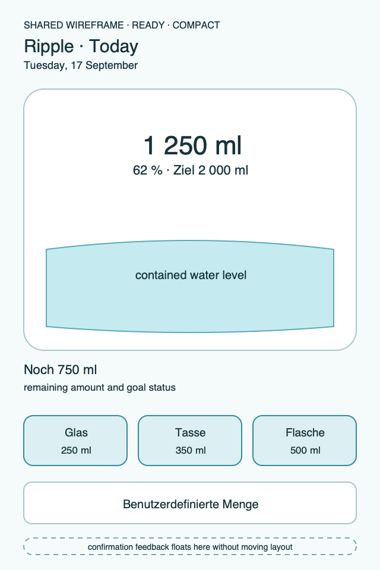
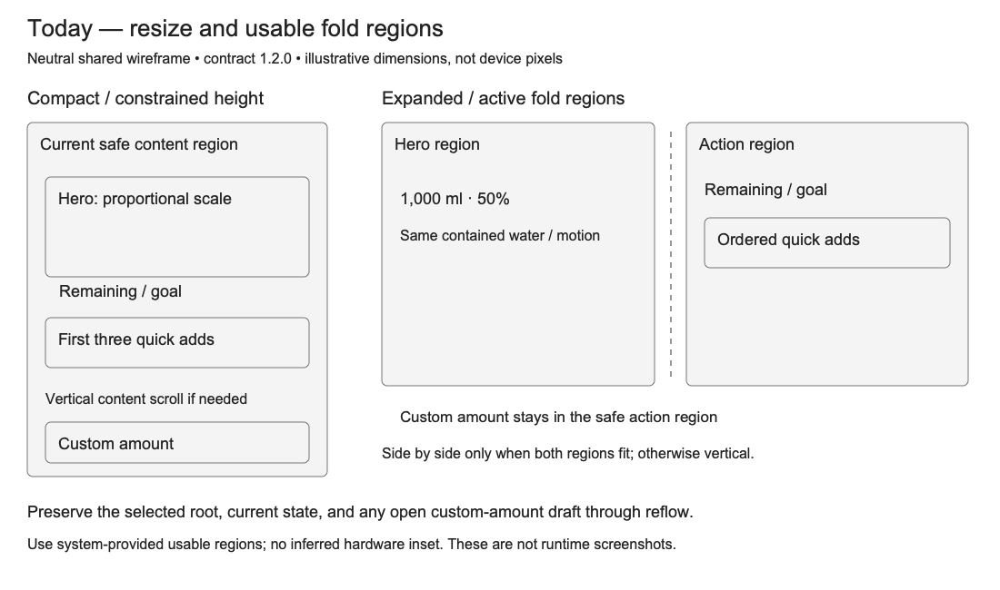

# Ripple Surface — Today

**Stable surface ID:** `today`
**Surface contract version:** 1.2.1
**Last verified:** 2026-09-23
**Kind:** Root screen
**Localized name:** `Heute` / `Today`

This is the canonical, platform-independent description of the Today surface.
It owns the layout and function of Today; platform documents only describe how
their native navigation and controls express this contract.

## Purpose and user outcome

The user can understand today's hydration state and log a predefined or custom
amount in one short interaction. The surface prioritizes the current state,
then the three most common saved-container actions, then custom entry.

## Entry and exit

Today is the primary daily surface opened by the app's root navigation. Moving
to another root preserves the current Today state. Selecting custom amount
opens [`custom-amount.md`](custom-amount.md) without changing data. Logging
does not leave Today. A transient confirmation or undo affordance may expire
when the owning surface is dismissed according to the platform lifecycle.

## Layout and region order

The semantic reading order is:

1. A day header with product identity and the localized current date.
2. A large, stylized two-dimensional glass vessel showing water level,
   consumed amount, percentage, and goal-aware status.
3. A remaining/goal label with amount and unit.
4. A fixed horizontal quick-add row containing the first three containers in
   persisted order. The row never scrolls; when three containers exist, the
   actions share the complete available width.
5. A full-width custom amount action.
6. Platform navigation chrome outside the feature content.

The hero readout remains above the water. The surface is visually stable while
confirmation feedback appears; feedback does not reserve a new layout region.
If fewer than three containers exist, only the available ordered actions are
shown and the custom action remains available.

## Reference evidence and visible-element inventory

**Reference set:** [iPhone Today](ios/iphone-today.png), [iPhone Duo outer display](ios/iphone-duo-today-outer.png), [Android phone Today](../Android/UI/phone-today.png), and [shared compact/adaptive wireframes](../wireframes/today--ready--compact.png)
**Reference classification:** Mixed current iOS targets, Android supporting evidence, and current shared semantic wireframes.
**States/viewports inspected:** Ready compact, zero/ready outer-display state, and constrained/expanded/fold-region reflow.
**System-owned chrome excluded from the shared wireframe:** Status bars, connectivity indicators, device/fold frames, iOS tab bar, and Android NavigationBar/Rail.

**Required product-owned composition:** Ripple/date context; contained glass hero with consumed amount, unit, percentage, and goal; remaining/goal status; exactly three ordered quick-add actions; explicit custom-amount action; layout-neutral success/undo feedback; adaptive hero/action regions with state and draft retention.

The complete element-by-element inventory, reference identity, crop/state notes,
and reconciliation decisions are maintained in the [Ripple visual reference
inventory](../Ripple_VISUAL_REFERENCE_INVENTORY.md#today). The linked
review note is part of this surface contract; it does not authorize behavior
outside the PRD or replace the native platform mapping.

## Platform-independent wireframes

Editable source: [today--ready--compact.svg](../wireframes/today--ready--compact.svg).

Caption: Representative ready state in a compact semantic viewport; shared surface contract version 1.2.1. The neutral illustration shows hierarchy only and does not prescribe native navigation or control appearance.

Editable source: [today--resize--adaptive.svg](../wireframes/today--resize--adaptive.svg).
Caption: Neutral resize/fold illustration, surface contract 1.2.1; not runtime evidence.
The earlier ready-state images remain representative baseline hierarchy references.

## Read model

Render from `TodaySnapshot` and the current ordered container projection:

- consumed amount, goal, remaining amount, percentage, and goal status;
- today's intake summaries needed by the hero and accessibility;
- display unit and locale;
- ordered saved containers, including ID, localized name, icon, amount, and
  default status;
- optional pacing/reminder context when the product provides it;
- sync/projection status that is informational and cannot make local logging
  unavailable.

Integer milliliters remain the domain value. Display conversion and localized
formatting happen at the surface boundary.

## Actions and domain operations

| User action | Operation | Result |
|---|---|---|
| Select an ordered quick-add action | `LogIntake` with the container amount and source `app` | One intake is stored, the snapshot updates, configured projections run, and localized transient confirmation names the amount. |
| Choose custom amount | Open `custom-amount` | No mutation occurs until confirmation. |
| Undo the latest eligible confirmation | `UndoLastIntake` | The latest own, non-deleted eligible intake is soft-deleted; the visible state reverses and feedback explains the result. |
| Change root section | Platform-local navigation | Today remains resumable without changing domain data. |

Every log path uses the same `LogIntake` boundary. Projection failure never
rolls back a locally stored intake.

## States

- **Loading:** Keep the header and hero shell stable; announce unavailable
  values and defer actions that require the ordered snapshot.
- **Empty:** Show a zero-level vessel, zero/goal status, and the first useful
  logging actions; do not invent a history or chart.
- **Ready:** Show the current level and the first three ordered containers.
- **Goal reached/over goal:** Keep the actual amount readable while capping
  visual progress at 100 percent.
- **No containers:** Keep custom amount available and provide a clear route to
  container setup.
- **Offline/sync unavailable:** Keep local logging available and show status
  inline; do not imply that the log failed merely because a projection failed.
- **Success:** Update the hero and show layout-neutral localized feedback.
- **Reduced motion:** Remove tilt, pour stream, and surface reaction; use the
  defined level cross-fade only.

## Validation and destructive behavior

A quick-add amount must be a positive stored container amount. The action must
not be enabled for an unresolved or invalid amount. Undo is limited to the
latest own, non-deleted eligible intake; it is not a general history editor.

## Accessibility and large text

The hero exposes consumed amount, goal, remaining amount, percentage, and goal
status as one coherent announcement. Each quick-add action announces its
container name, icon meaning, amount, unit, and logging result. The custom
action announces that it opens amount entry. Reading/focus order follows the
region order. At the largest text size, the hero readout may scale or wrap but
must not clip; the three actions remain individually operable.

## Design tokens and reusable elements

Use `DayHeader`, the hero vessel/water primitives, `RemainingLabel`,
`QuickAddCluster`, `ContainerChip`, `LogButton`, and `RippleToast`. Every
custom visual uses the color, typography, spacing, shape, and motion tokens in
[`../Ripple_DESIGN_SYSTEM.md`](../Ripple_DESIGN_SYSTEM.md). Native navigation
and ordinary controls retain their platform behavior.

## Responsive/platform-independent behavior

The current usable container size determines the presentation, including while
resizing or folding; the device category is not a layout input. Compact layouts
keep the fixed three-action row. Expanded layouts place hero and actions side
by side only when both regions fit; otherwise they retain the vertical order.
The hero scales proportionally within the documented maximum dimensions and
keeps a readable minimum. When height is constrained, the content scrolls
vertically while the custom amount action remains in the safe action region.
The quick-add row itself never scrolls horizontally. During an active fold,
place hero and actions in the system-provided usable regions. Preserve selected
root, snapshot, active pour, and any open custom-entry draft through reflow.
Never add a fourth primary action. Wearable and system surfaces use their own
canonical IDs and are not shrunk copies of this surface.

## Forbidden behavior

- A scrollable Today quick-add row.
- More than three actions in the primary Today row.
- A circular progress indicator as the hero.
- An idle animated water surface, permanent wave, or single-drop add metaphor.
- A confirmation that shifts the hero, quick-add row, or custom action.
- A second persistence or amount-resolution path outside `LogIntake`.

## Timeline

| Version | Date | Change | Impact |
|---|---|---|---|
| 1.0.0 | 2026-09-11 | Established the canonical platform-independent Today description. | iOS and Android share one semantic Today outcome and action boundary. |
| 1.1.0 | 2026-09-18 | Added the shared ready-state wireframe and verified the contract against the Apple 1.1 baseline. | Android receives a current neutral layout reference without replacing native controls or runtime evidence. |
| 1.2.0 | 2026-09-19 | Specified container-driven resize/fold composition and preserved presentation state; added an adaptive wireframe. | Compact and expanded windows retain usable content and ongoing interaction. |

| 1.2.1 | 2026-09-23 | Added current-reference classification and a linked visible-element inventory for this surface. | Product-owned regions, state/viewport coverage, and system-chrome exclusions are traceable for the cross-platform handoff. |

## Related contracts

- [`../Ripple_PRD.md`](../Ripple_PRD.md)
- [`../Ripple_SCREEN_CATALOG.md`](../Ripple_SCREEN_CATALOG.md)
- [`../Ripple_DESIGN_SYSTEM.md`](../Ripple_DESIGN_SYSTEM.md)
- [`../Ripple_DATA_MODEL.md`](../Ripple_DATA_MODEL.md)
- [`../Android/ANDROID_ARCHITECTURE.md`](../Android/ANDROID_ARCHITECTURE.md)
- [`../IOS_ARCHITECTURE.md`](../IOS_ARCHITECTURE.md)
- [`../Android/ANDROID_UI_SPEC.md`](../Android/ANDROID_UI_SPEC.md)
