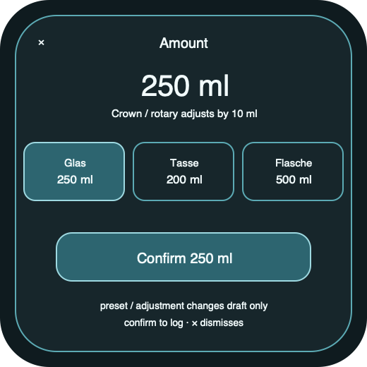

# Ripple Surface — Wear custom amount

**Stable surface ID:** `watch-custom-amount`
**Surface contract version:** 1.1.2
**Last verified:** 2026-09-23
**Kind:** Wearable sheet
**Localized name:** `Menge` / `Custom amount`

This is the canonical wearable custom amount contract.

## Purpose and user outcome

The user selects one of three configured amount presets or adjusts the current
amount with the Crown/rotary input, then explicitly confirms one local intake.

## Entry and exit

The surface opens from the single `+` action on Wear Today. The system `×`
dismisses and discards the draft; there is no additional Cancel action. Confirm
calls `LogIntake` with source `watch` and returns to Wear Today after local
persistence.

## Layout and region order

1. System dismissal context (`×`) and localized amount title.
2. Current amount and unit.
3. Three configured preset choices with amount and selection state.
4. Adjustable amount input with minimum, maximum, and 10 ml step; Crown/rotary
   changes only the draft.
5. Explicit confirm action.

The amount remains the primary input. Selecting a preset only changes the
draft. Adjusting the Crown/rotary resolves the draft as a custom amount without
a container ID. The full phone container catalog is not required to appear.

## Reference evidence and visible-element inventory

**Reference set:** [shared wearable custom-amount wireframe](../wireframes/watch-custom-amount--ready--wearable.png); no runtime capture is currently designated
**Reference classification:** Current shared semantic wireframe.
**States/viewports inspected:** Ready wearable, invalid, offline, and reduced-motion.
**System-owned chrome excluded from the shared wireframe:** Native crown/rotary input and sheet dismissal chrome.

**Required product-owned composition:** System dismissal/title; current amount/unit; exactly three configured presets with selected state; adjustable range and step; explicit Confirm; no logging from preset selection or adjustment alone.

The complete element-by-element inventory, reference identity, crop/state notes,
and reconciliation decisions are maintained in the [Ripple visual reference
inventory](../Ripple_VISUAL_REFERENCE_INVENTORY.md#watch-custom-amount). The linked
review note is part of this surface contract; it does not authorize behavior
outside the PRD or replace the native platform mapping.

## Platform-independent wireframes

Editable source: [watch-custom-amount--ready--wearable.svg](../wireframes/watch-custom-amount--ready--wearable.svg).

Caption: Representative ready state in the wearable semantic viewport; shared surface contract version 1.1.2. The neutral illustration shows hierarchy only and does not prescribe native navigation or control appearance.

## Read model

Read the wearable `TodaySnapshot`, preferred unit, valid amount range, and the
three configured preset values with their optional container identities.

## Actions and domain operations

Selecting a preset or adjusting the amount changes a local draft only. Confirm
calls `LogIntake` with source `watch` and the preset's container identity when
unchanged; Crown/rotary adjustment clears that identity. System dismissal
performs no mutation.

## States

The standard amount range is 50–2,000 ml in 10 ml steps. Invalid or unresolved
values disable confirmation and state the range. Offline local persistence
remains usable. Projection failure does not roll back a stored log. Reduced
motion removes decorative transitions.

## Validation and destructive behavior

The amount must be positive and within the supported range. Cancel is
non-destructive; no delete action exists on this surface.

## Accessibility and large text

Announce current value, unit, minimum, maximum, selected preset/container when
present, and confirm result. Crown/rotary, touch, voice, and assistive
adjustment alternatives use standard affordances. Content may page or scroll
only when it preserves access to Confirm and dismissal.

## Design tokens and reusable elements

Use wearable amount, action, selection, sheet, type, spacing, and feedback
contracts from [`../Ripple_DESIGN_SYSTEM.md`](../Ripple_DESIGN_SYSTEM.md).

## Responsive/platform-independent behavior

The surface may page or reflow for wearable size, but the amount remains above
the three presets and Confirm remains discoverable.

## Forbidden behavior

- Requiring a phone keyboard.
- Showing the full phone container catalog.
- Logging while only adjusting the draft.
- A separate wearable persistence or amount-resolution path.

## Timeline

| Version | Date | Change | Impact |
|---|---|---|---|
| 1.0.0 | 2026-09-11 | Established the canonical platform-independent Wear custom amount description. | iOS and Android share one semantic surface outcome and action boundary. |
| 1.1.0 | 2026-09-18 | Added the shared ready-state wireframe and verified the contract against the Apple 1.1 baseline. | Android receives a current neutral layout reference without replacing native controls or runtime evidence. |

| 1.1.1 | 2026-09-23 | Added current-reference classification and a linked visible-element inventory for this surface. | Product-owned regions, state/viewport coverage, and system-chrome exclusions are traceable for the cross-platform handoff. |
| 1.1.2 | 2026-09-23 | Aligned the amount sheet to the PRD's three preset choices, Crown/rotary adjustment, single confirmation, and system-only dismissal. | Preset selection and adjustment remain draft-only; a custom adjustment clears container identity before the shared log operation. |

## Related contracts

- [`../Ripple_PRD.md`](../Ripple_PRD.md)
- [`../Ripple_SCREEN_CATALOG.md`](../Ripple_SCREEN_CATALOG.md)
- [`../Ripple_DESIGN_SYSTEM.md`](../Ripple_DESIGN_SYSTEM.md)
- [`../Ripple_DATA_MODEL.md`](../Ripple_DATA_MODEL.md)
- [`../IOS_ARCHITECTURE.md`](../IOS_ARCHITECTURE.md)
- [`../Android/ANDROID_ARCHITECTURE.md`](../Android/ANDROID_ARCHITECTURE.md)
- [`../Android/ANDROID_UI_SPEC.md`](../Android/ANDROID_UI_SPEC.md)
- [`watch-today.md`](watch-today.md)
