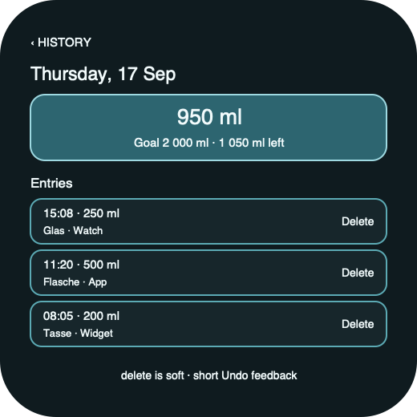

# Ripple Surface — Wear Day Detail

**Stable surface ID:** `watch-day-detail`
**Surface contract version:** 1.1.1
**Last verified:** 2026-09-23
**Kind:** Wearable screen
**Localized name:** Localized selected date

This is the canonical wearable day-detail contract.

## Purpose and user outcome

The user reviews the total and individual entries for one recent elapsed day
and can delete an individual entry when the domain allows it.

## Entry and exit

The surface opens from Wear History. Back returns to the seven-day collection.
It never adds an entry to a past day. A delete uses the platform's explicit
confirmation/undo pattern and returns the updated day state.

## Layout and region order

1. Selected date context.
2. Compact day total, goal, remaining, and status.
3. Chronological intake rows.
4. Empty state when no entries exist.
5. Row-level edit/delete actions where supported, with delete clearly
   destructive and undoable through the defined feedback.

## Reference evidence and visible-element inventory

**Reference set:** [Android Wear Day Detail](../Android/UI/wear-day-detail.png) and [shared wearable wireframe](../wireframes/watch-day-detail--ready--wearable.png); no Apple runtime capture
**Reference classification:** Android supporting evidence plus shared semantic wireframe.
**States/viewports inspected:** Ready selected day, empty, individual delete, and undo feedback.
**System-owned chrome excluded from the shared wireframe:** Native swipe-back, rotary focus, and destructive confirmation surface.

**Required product-owned composition:** Back/date context; selected-day total/goal/remaining; chronological entry rows with time/amount/source/container; individual soft-delete action; Undo feedback.

The complete element-by-element inventory, reference identity, crop/state notes,
and reconciliation decisions are maintained in the [Ripple visual reference
inventory](../Ripple_VISUAL_REFERENCE_INVENTORY.md#watch-day-detail). The linked
review note is part of this surface contract; it does not authorize behavior
outside the PRD or replace the native platform mapping.

## Platform-independent wireframes

Editable source: [watch-day-detail--ready--wearable.svg](../wireframes/watch-day-detail--ready--wearable.svg).

Caption: Representative ready state in the wearable semantic viewport; shared surface contract version 1.1.1. The neutral illustration shows hierarchy only and does not prescribe native navigation or control appearance.

## Read model

Read the selected `DaySummary` and intake rows via `ObserveHistory`.

## Actions and domain operations

Edit uses the shared edit operation where supported. Delete calls
`DeleteIntake`; restore uses `RestoreIntake` or the defined undo action. Totals
refresh from the domain snapshot.

## States

Loading preserves the selected date. Empty shows no-entry copy. Mutation errors
keep the row and explain retry. Delete success removes the row softly and
offers transient Undo. Offline local state remains visible. Reduced motion
removes decorative transitions.

## Validation and destructive behavior

Delete is soft and requires the platform's explicit destructive confirmation.
The surface never adds an entry to a past day.

## Accessibility and large text

Announce date and total before rows. Each row exposes time, amount, unit,
container/source when known, and available actions. Delete announces the
consequence and undo window. Content may use compact row navigation and rotary
selection but must keep the selected date visible.

## Design tokens and reusable elements

Use wearable day summary, entry row, empty state, destructive action, feedback,
type, spacing, and color contracts from [`../Ripple_DESIGN_SYSTEM.md`](../Ripple_DESIGN_SYSTEM.md).

## Responsive/platform-independent behavior

Rows may reflow or page for wearable size, but selected date → summary → rows
remains the semantic order.

## Forbidden behavior

- Adding to a past day.
- Hard deletion.
- Editing by appending a replacement row.
- Phone History/Stats chrome or a moving historical water hero.

## Timeline

| Version | Date | Change | Impact |
|---|---|---|---|
| 1.0.0 | 2026-09-11 | Established the canonical platform-independent Wear Day Detail description. | iOS and Android share one semantic surface outcome and action boundary. |
| 1.1.0 | 2026-09-18 | Added the shared ready-state wireframe and verified the contract against the Apple 1.1 baseline. | Android receives a current neutral layout reference without replacing native controls or runtime evidence. |

| 1.1.1 | 2026-09-23 | Added current-reference classification and a linked visible-element inventory for this surface. | Product-owned regions, state/viewport coverage, and system-chrome exclusions are traceable for the cross-platform handoff. |

## Related contracts

- [`../Ripple_PRD.md`](../Ripple_PRD.md)
- [`../Ripple_SCREEN_CATALOG.md`](../Ripple_SCREEN_CATALOG.md)
- [`../Ripple_DESIGN_SYSTEM.md`](../Ripple_DESIGN_SYSTEM.md)
- [`../Ripple_DATA_MODEL.md`](../Ripple_DATA_MODEL.md)
- [`../IOS_ARCHITECTURE.md`](../IOS_ARCHITECTURE.md)
- [`../Android/ANDROID_ARCHITECTURE.md`](../Android/ANDROID_ARCHITECTURE.md)
- [`../Android/ANDROID_UI_SPEC.md`](../Android/ANDROID_UI_SPEC.md)
- [`watch-history.md`](watch-history.md)
- [`day-detail.md`](day-detail.md)
