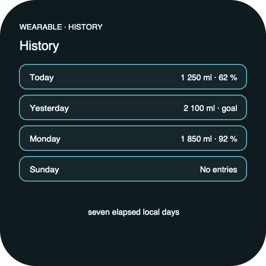

# Ripple Surface — Wear History

**Stable surface ID:** `watch-history`  
**Surface contract version:** 1.1.0
**Last verified:** 2026-09-18
**Kind:** Wearable screen  
**Localized name:** `Verlauf` / `History`

This is the canonical wearable recent-history contract.

## Purpose and user outcome

The user reviews the seven most recent elapsed local days and opens one day for
entry detail. Wear History is deliberately not the phone's month calendar.

## Entry and exit

The surface is the wearable History page. Selecting an elapsed day opens
[`watch-day-detail.md`](watch-day-detail.md). A future local day is excluded
or clearly unavailable. Back returns to the wearable page context.

## Layout and region order

1. History title/date context.
2. Seven-day chronological day collection, newest or platform-preferred order
   stated by the local navigation convention.
3. Day total, goal status, and compact progress marker per day.
4. Empty/sync status.

## Platform-independent wireframes

Editable source: [watch-history--ready--wearable.svg](../wireframes/watch-history--ready--wearable.svg).

Caption: Representative ready state in the wearable semantic viewport; shared surface contract version 1.1.0. The neutral illustration shows hierarchy only and does not prescribe native navigation or control appearance.

## Read model

Read `HistorySnapshot` for the recent seven elapsed local days.

## Actions and domain operations

`ObserveHistory` refreshes the collection. Selecting a day opens detail and
performs no write.

## States

Loading retains the title and collection frame. Empty days show zero progress,
not invented entries. Sync failure preserves cached local values. No future day
is selectable. Reduced motion avoids list-introduction animation.

## Validation and destructive behavior

Future days are not actionable and History does not mutate entries directly.

## Accessibility and large text

Each day announces localized date, consumed amount, goal, percentage, and
status. Selection is available through touch, crown/rotary, and assistive
navigation. The collection uses compact wearable rows and must not become a
month grid or hide the selected date.

## Design tokens and reusable elements

Use wearable day rows, progress markers, empty state, sync status, type,
spacing, and color roles from [`../Ripple_DESIGN_SYSTEM.md`](../Ripple_DESIGN_SYSTEM.md).

## Responsive/platform-independent behavior

The seven-day collection may use native compact scrolling or paging, but it
must keep all seven elapsed days reachable and preserve chronological meaning.

## Forbidden behavior

- A month pager or month calendar.
- Stats charts on History.
- Tappable future days.
- A projection replacing the domain day total.

## Timeline

| Version | Date | Change | Impact |
|---|---|---|---|
| 1.0.0 | 2026-09-11 | Established the canonical platform-independent Wear History description. | iOS and Android share one semantic surface outcome and action boundary. |
| 1.1.0 | 2026-09-18 | Added the shared ready-state wireframe and verified the contract against the Apple 1.1 baseline. | Android receives a current neutral layout reference without replacing native controls or runtime evidence. |

## Related contracts

- [`../Ripple_PRD.md`](../Ripple_PRD.md)
- [`../Ripple_SCREEN_CATALOG.md`](../Ripple_SCREEN_CATALOG.md)
- [`../Ripple_DESIGN_SYSTEM.md`](../Ripple_DESIGN_SYSTEM.md)
- [`../Ripple_DATA_MODEL.md`](../Ripple_DATA_MODEL.md)
- [`../IOS_ARCHITECTURE.md`](../IOS_ARCHITECTURE.md)
- [`../Android/ANDROID_ARCHITECTURE.md`](../Android/ANDROID_ARCHITECTURE.md)
- [`../Android/ANDROID_UI_SPEC.md`](../Android/ANDROID_UI_SPEC.md)
- [`watch-day-detail.md`](watch-day-detail.md)
