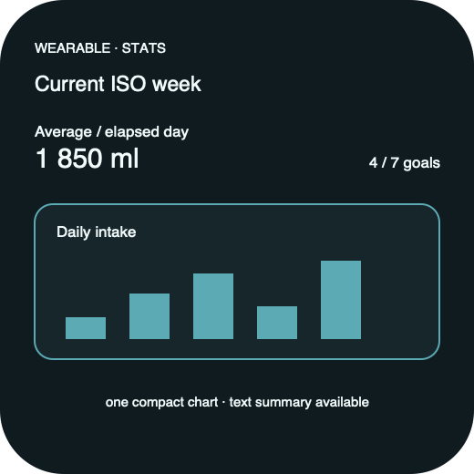

# Ripple Surface — Wear Stats

**Stable surface ID:** `watch-stats`
**Surface contract version:** 1.1.1
**Last verified:** 2026-09-23
**Kind:** Wearable screen
**Localized name:** `Statistik` / `Stats`

This is the canonical current-week wearable Stats contract.

## Purpose and user outcome

The user sees a concise hydration summary for the current ISO week and one
compact chart without navigating a phone-style analysis dashboard.

## Entry and exit

Wear Stats is a sibling wearable page. It has no period picker. Back or page
navigation returns to Wear Today or Wear History.

## Layout and region order

1. Stats title/current ISO-week context.
2. Summary total, goal/hit context, and relevant highlight.
3. One compact chart with an accessible textual summary.
4. Empty/offline/error feedback.

## Reference evidence and visible-element inventory

**Reference set:** [Apple Watch Stats](ios/watch-stats.png), [Android Wear Stats](../Android/UI/wear-stats.png), and [shared wearable wireframe](../wireframes/watch-stats--ready--wearable.png)
**Reference classification:** Current wearable evidence and shared semantic wireframe.
**States/viewports inspected:** Current ISO week ready, empty/offline, and reduced motion.
**System-owned chrome excluded from the shared wireframe:** Watch/Wear time, page indicators, and native chart interaction chrome.

**Required product-owned composition:** Current ISO-week range; average per elapsed day; goal hits; total; exactly one compact chart; textual/value alternative; no period picker.

The complete element-by-element inventory, reference identity, crop/state notes,
and reconciliation decisions are maintained in the [Ripple visual reference
inventory](../Ripple_VISUAL_REFERENCE_INVENTORY.md#watch-stats). The linked
review note is part of this surface contract; it does not authorize behavior
outside the PRD or replace the native platform mapping.

## Platform-independent wireframes

Editable source: [watch-stats--ready--wearable.svg](../wireframes/watch-stats--ready--wearable.svg).

Caption: Representative ready state in the wearable semantic viewport; shared surface contract version 1.1.1. The neutral illustration shows hierarchy only and does not prescribe native navigation or control appearance.

## Read model

Read `StatsSnapshot` for the current ISO week through `ObserveStats`.

## Actions and domain operations

Chart selection is presentation-only. Retry refreshes the snapshot. There is
no write operation.

## States

Loading keeps summary/chart framing stable. Empty shows zero-state copy and no
invented marks. Offline keeps cached values with freshness status. Error offers
retry. Future portions do not count as completed days. Reduced motion removes
chart entrance choreography.

## Validation and destructive behavior

Future portions do not count as completed days. Stats has no destructive action
and does not mutate the domain.

## Accessibility and large text

Announce week range, totals, goal context, chart summary, and units. Every
visual mark has a value/date alternative. The layout adapts to wearable size
and native navigation without adding a period picker or four-chart composition.

## Design tokens and reusable elements

Use the wearable summary, compact chart, empty/error, type, spacing, and motion
tokens from [`../Ripple_DESIGN_SYSTEM.md`](../Ripple_DESIGN_SYSTEM.md).

## Responsive/platform-independent behavior

The chart and summary may stack or page for wearable size, but the current ISO
week remains explicit and the period picker remains absent.

## Forbidden behavior

- A week/month/year picker.
- Four phone chart families.
- A combined History/Stats destination.
- A chart without a textual summary.
- Health/projection values replacing the domain snapshot.

## Timeline

| Version | Date | Change | Impact |
|---|---|---|---|
| 1.0.0 | 2026-09-11 | Established the canonical platform-independent Wear Stats description. | iOS and Android share one semantic surface outcome and action boundary. |
| 1.1.0 | 2026-09-18 | Added the shared ready-state wireframe and verified the contract against the Apple 1.1 baseline. | Android receives a current neutral layout reference without replacing native controls or runtime evidence. |

| 1.1.1 | 2026-09-23 | Added current-reference classification and a linked visible-element inventory for this surface. | Product-owned regions, state/viewport coverage, and system-chrome exclusions are traceable for the cross-platform handoff. |

## Related contracts

- [`../Ripple_PRD.md`](../Ripple_PRD.md)
- [`../Ripple_SCREEN_CATALOG.md`](../Ripple_SCREEN_CATALOG.md)
- [`../Ripple_DESIGN_SYSTEM.md`](../Ripple_DESIGN_SYSTEM.md)
- [`../Ripple_DATA_MODEL.md`](../Ripple_DATA_MODEL.md)
- [`../IOS_ARCHITECTURE.md`](../IOS_ARCHITECTURE.md)
- [`../Android/ANDROID_ARCHITECTURE.md`](../Android/ANDROID_ARCHITECTURE.md)
- [`../Android/ANDROID_UI_SPEC.md`](../Android/ANDROID_UI_SPEC.md)
- [`watch-history.md`](watch-history.md)
