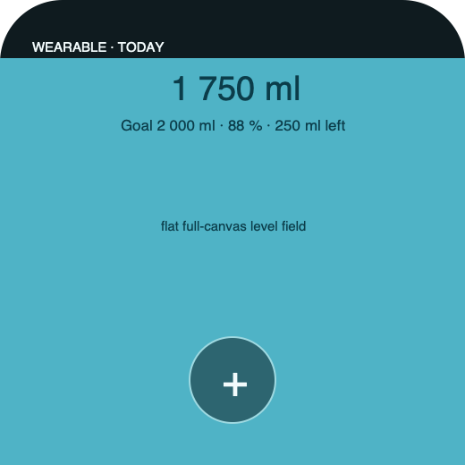

# Ripple Surface — Wear Today

**Stable surface ID:** `watch-today`
**Surface contract version:** 1.1.2
**Last verified:** 2026-09-23
**Kind:** Wearable root screen
**Localized name:** `Heute` / `Today`

This is the canonical wearable Today contract. It preserves the domain outcome
of Today while using compact wearable navigation and input.

## Purpose and user outcome

The user sees the current hydration level and opens one amount-entry action
while away from the phone. The amount sheet owns preset selection, adjustment,
and explicit confirmation.

## Entry and exit

Wearable navigation opens this surface as the Today page. The single `+`
logging action opens [`watch-custom-amount.md`](watch-custom-amount.md) without
writing. History and Stats are sibling wearable pages. A successful confirmed
log returns here with transient confirmation; eligible feedback may offer
`UndoLastIntake`.

## Layout and region order

1. Full-canvas flat water-level field.
2. Compact consumed amount/unit, goal, remaining, and percentage readout.
3. One explicit `+` amount-entry action.
4. Transient confirmation/undo feedback after a confirmed log.

The water field is a static idle surface with a readable level. It is not a
phone hero compressed into a smaller rectangle.

## Reference evidence and visible-element inventory

**Reference set:** [Apple Watch Today](ios/watch-today.png), [Android Wear Today](../Android/UI/wear-today.png), and [shared wearable wireframe](../wireframes/watch-today--ready--wearable.png)
**Reference classification:** Apple Watch Today is the current visual target. The Android Wear illustration is supporting platform evidence aligned to the same single-entry-point flow; neither platform image is runtime proof.
**States/viewports inspected:** Ready wearable, empty/goal/offline, success feedback, and reduced motion.
**System-owned chrome excluded from the shared wireframe:** Watch/Wear time, page dots, crown/rotary affordance, and native page navigation.

**Required product-owned composition:** Today context; consumed/unit, goal, remaining, and percentage; full-canvas flat static level field; exactly one `+` action opening amount entry; completion/undo feedback. The three preset amounts and confirm action belong to the linked amount sheet, not this screen.

The complete element-by-element inventory, reference identity, crop/state notes,
and reconciliation decisions are maintained in the [Ripple visual reference
inventory](../Ripple_VISUAL_REFERENCE_INVENTORY.md#watch-today). The linked
review note is part of this surface contract; it does not authorize behavior
outside the PRD or replace the native platform mapping.

## Platform-independent wireframes

Editable source: [watch-today--ready--wearable.svg](../wireframes/watch-today--ready--wearable.svg).

Caption: Representative ready state in the wearable semantic viewport; shared surface contract version 1.1.2. The neutral illustration shows hierarchy only and does not prescribe native navigation or control appearance.

## Read model

Read `TodaySnapshot`, ordered containers, preferred unit, and sync status.

## Actions and domain operations

The `+` action opens the amount sheet and performs no mutation. Confirmation
there calls `LogIntake` with source `watch` through the same domain boundary as
the main app. Undo calls `UndoLastIntake` when supported. No wearable-specific
amount logic may diverge.

## States

- Empty, ready, goal, over-goal, offline, and success follow [`today.md`](today.md).
- Permission is never required for a local log.
- Unavailable sync is visible but does not remove local logging.
- Reduced motion removes water motion and uses a level cross-fade.

## Validation and destructive behavior

The `+` action never writes by itself. Amount validation and preset identity
are owned by the amount sheet. Undo is limited to the latest eligible own
intake.

## Accessibility and large text

The `+` action has a localized accessible name that explains it opens amount
entry. The level announces consumed amount, goal, remaining, percentage, and
goal status. Touch, Crown/rotary, voice, and assistive input paths remain
usable.

## Design tokens and reusable elements

Use wearable variants of the shared water, log, amount, day, toast, type,
spacing, and motion contracts in [`../Ripple_DESIGN_SYSTEM.md`](../Ripple_DESIGN_SYSTEM.md).

## Responsive/platform-independent behavior

The platform may change page chrome, hit targets, and input order for wearable
ergonomics, but not the logging outcome.

## Forbidden behavior

- Phone tab chrome or phone-sized hero geometry.
- A month calendar or Stats chart on this page.
- Multiple direct logging actions on the Today page.
- A scroll-heavy action region.
- An idle wave loop, pour stream in a system surface, or projection-only log.
- A second `LogIntake` implementation.

## Timeline

| Version | Date | Change | Impact |
|---|---|---|---|
| 1.0.0 | 2026-09-11 | Established the canonical platform-independent Wear Today description. | iOS and Android share one semantic surface outcome and action boundary. |
| 1.1.0 | 2026-09-18 | Added the shared ready-state wireframe and verified the contract against the Apple 1.1 baseline. | Android receives a current neutral layout reference without replacing native controls or runtime evidence. |

| 1.1.1 | 2026-09-23 | Added current-reference classification and a linked visible-element inventory for this surface. | Product-owned regions, state/viewport coverage, and system-chrome exclusions are traceable for the cross-platform handoff. |
| 1.1.2 | 2026-09-23 | Aligned the shared wearable Today flow and wireframe with the PRD's single `+` entry point, complete goal readout, separate preset/confirm sheet, and 88% water level. | Preset selection and adjustment no longer appear to log directly from Today; both wearable illustrations match the readout and share the documented outcome. |

## Related contracts

- [`../Ripple_PRD.md`](../Ripple_PRD.md)
- [`../Ripple_SCREEN_CATALOG.md`](../Ripple_SCREEN_CATALOG.md)
- [`../Ripple_DESIGN_SYSTEM.md`](../Ripple_DESIGN_SYSTEM.md)
- [`../Ripple_DATA_MODEL.md`](../Ripple_DATA_MODEL.md)
- [`../IOS_ARCHITECTURE.md`](../IOS_ARCHITECTURE.md)
- [`../Android/ANDROID_ARCHITECTURE.md`](../Android/ANDROID_ARCHITECTURE.md)
- [`../Android/ANDROID_UI_SPEC.md`](../Android/ANDROID_UI_SPEC.md)
- [`today.md`](today.md)
- [`watch-custom-amount.md`](watch-custom-amount.md)
