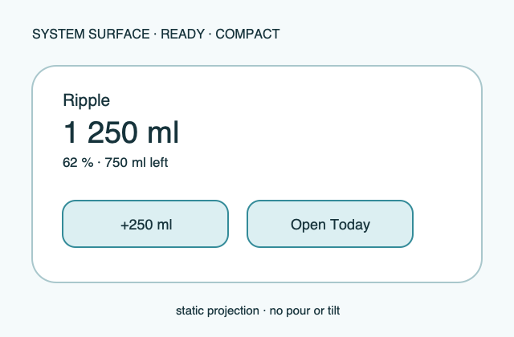

# Ripple Surface — Widget

**Stable surface ID:** `widget`
**Surface contract version:** 1.1.1
**Last verified:** 2026-09-23
**Kind:** System surface
**Localized name:** Platform-local widget name

This is the canonical contract for Ripple's home/lock/system widget
projection. It is a focused system entry point, not another app screen.

## Purpose and user outcome

The user can glance at consumed/remaining or goal status and, where the widget
family permits, perform a focused predefined log action.

## Entry and exit

The operating system places and refreshes the widget from a Ripple snapshot.
An action calls the shared logging adapter and may return to the system surface
or open the relevant app context. More detailed history, settings, and custom
entry belong to the app.

## Layout and region order

1. Static contained-glass silhouette or water-level representation.
2. Consumed/remaining amount and goal status.
3. One or more focused quick actions where supported.
4. Optional freshness/unavailable status.

The layout adapts to available widget size while preserving the same priority.

## Reference evidence and visible-element inventory

**Reference set:** [shared widget wireframe](../wireframes/widget--ready--compact.png); no runtime capture is currently designated
**Reference classification:** Current shared system-surface illustration; host family geometry remains native.
**States/viewports inspected:** Static ready, goal/over-goal, stale/unavailable, and family-size reflow.
**System-owned chrome excluded from the shared wireframe:** Host placement, family frame, refresh controls, and system widget chrome.

**Required product-owned composition:** Static water/progress representation; consumed/remaining/goal values; focused predefined action where supported; explicit freshness/unavailable state.

The complete element-by-element inventory, reference identity, crop/state notes,
and reconciliation decisions are maintained in the [Ripple visual reference
inventory](../Ripple_VISUAL_REFERENCE_INVENTORY.md#widget). The linked
review note is part of this surface contract; it does not authorize behavior
outside the PRD or replace the native platform mapping.

## Platform-independent wireframes

Editable source: [widget--ready--compact.svg](../wireframes/widget--ready--compact.svg).

Caption: Representative ready state in the compact semantic viewport; shared surface contract version 1.1.1. The neutral illustration shows hierarchy only and does not prescribe native navigation or control appearance.

## Read model

Use a snapshot/projection containing current day values, goal, remaining,
percentage, and the permitted default/quick action.

## Actions and domain operations

A quick action invokes
`LogIntake` with source `widget` through the shared boundary. The widget never
creates or mutates persistence directly.

## States

- **Ready:** Show current snapshot and permitted action.
- **Stale/unavailable:** State freshness or unavailable data explicitly.
- **Goal/over-goal:** Keep actual amount text and cap visual progress.
- **Action failure:** Report the system action result without pretending a log
  was stored.
- **Reduced motion/system limitation:** Always remain static.

## Validation and destructive behavior

Only a positive resolved quick amount can be offered as an action. The widget
has no destructive behavior; any undo or detailed correction belongs to the
owning app surface.

## Accessibility and large text

The widget announces consumed amount, goal, remaining, percentage, and action
amount. Each action has a complete label and source context. Small, medium, and
large families may rearrange regions but never add a calendar or Stats chart.

## Design tokens and reusable elements

Use the widget glass, readout, action, color, type, spacing, and accessibility
contracts from [`../Ripple_DESIGN_SYSTEM.md`](../Ripple_DESIGN_SYSTEM.md). The
system owns widget placement, refresh cadence, and host chrome.

## Responsive/platform-independent behavior

Small, medium, and large families may rearrange regions and increase text
space, but the snapshot → status → action priority remains unchanged.

## Forbidden behavior

- Direct persistence or projection writes from widget presentation.
- Pour stream, motion tilt, idle surface animation, calendar, or Stats chart.
- A second amount-resolution implementation.
- A widget that implies stale data is current without status.

## Timeline

| Version | Date | Change | Impact |
|---|---|---|---|
| 1.0.0 | 2026-09-11 | Established the canonical platform-independent Widget description. | iOS and Android share one semantic surface outcome and action boundary. |
| 1.1.0 | 2026-09-18 | Added the shared ready-state wireframe and verified the contract against the Apple 1.1 baseline. | Android receives a current neutral layout reference without replacing native controls or runtime evidence. |

| 1.1.1 | 2026-09-23 | Added current-reference classification and a linked visible-element inventory for this surface. | Product-owned regions, state/viewport coverage, and system-chrome exclusions are traceable for the cross-platform handoff. |

## Related contracts

- [`../Ripple_PRD.md`](../Ripple_PRD.md)
- [`../Ripple_SCREEN_CATALOG.md`](../Ripple_SCREEN_CATALOG.md)
- [`../Ripple_DESIGN_SYSTEM.md`](../Ripple_DESIGN_SYSTEM.md)
- [`../Ripple_DATA_MODEL.md`](../Ripple_DATA_MODEL.md)
- [`../IOS_ARCHITECTURE.md`](../IOS_ARCHITECTURE.md)
- [`../Android/ANDROID_ARCHITECTURE.md`](../Android/ANDROID_ARCHITECTURE.md)
- [`../Android/ANDROID_UI_SPEC.md`](../Android/ANDROID_UI_SPEC.md)
- [`today.md`](today.md)
