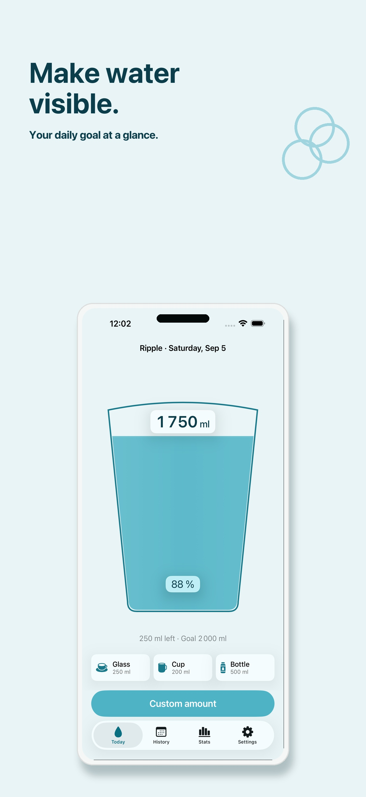
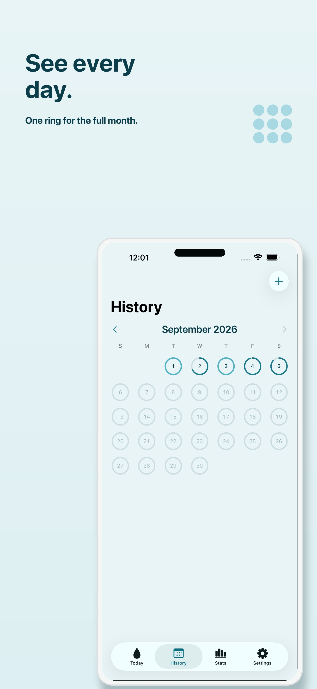
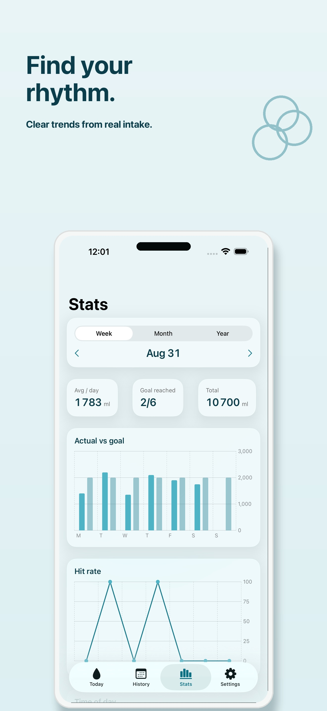

# Ripple – Water Tracker

Hydration that follows you.

Ripple is a calm, open-source water tracker for Apple devices. Log water from
the app, a widget, Control Center, Apple Watch, Siri or Shortcuts, or a
reminder. The app is the quiet place for today's level, history, statistics,
and personal setup.

[Download Ripple on the App Store](https://apps.apple.com/us/app/ripple-water-tracker/id6808143149) ·
[View the source on GitHub](https://github.com/Urkman/ripple)

## Screenshots

<p align="center">
  
  
  
</p>

The complete release screenshot set is in
[`release/screenshots/marketing/`](release/screenshots/marketing/).

## Features

- **Log water wherever you are.** Every entry records an amount, timestamp,
  source, and optional container. Rapid taps remain individual entries while
  the Today hero presents them as one continuous pour.
- **Today at a glance.** See consumed volume, goal, remaining amount, pacing,
  and progress in a contained 2D glass hero. Quick adds use the first three
  saved containers; custom amounts can use any saved container.
- **Flexible goals.** Choose a manual daily goal or calculate one from body
  mass and activity. Calculated goals remain editable and can always be
  overridden manually.
- **History.** Review an Activity-style month grid with one capped ring per
  day. Open a day to inspect entries, edit them, delete them, or undo a
  deletion. Future days are not selectable.
- **Stats.** Keep statistics separate from History and switch between week,
  month, and year periods. Swift Charts show goal versus actual intake, goal
  hit rate, day-part distribution, and container usage, with summaries and
  highlights.
- **Personal setup.** Configure milliliters or fluid ounces, saved containers,
  reminders, wake and sleep times, haptics, Health access, and export.
- **Fast system surfaces.** Use interactive iOS widgets, Lock Screen and
  StandBy surfaces, a Control Center control, Siri and App Shortcuts, Apple
  Watch complications, and reminder actions.
- **Export.** Export the stored data as CSV or JSON from Settings.
- **Localized and accessible.** Ripple supports German and English, Dark Mode,
  Dynamic Type through XXXL, VoiceOver, and Reduce Motion.

Ripple is water-only in the current product scope. It deliberately has no
accounts, advertising, subscriptions, in-app purchases, analytics SDK, custom
backend, social features, streak product, or Live Activity.

## Apple platforms

The repository contains native targets for the full Apple-device scope. The
released app is linked above; the target matrix below describes the source
project.

| Target or surface | Experience |
| --- | --- |
| iOS / iPadOS | Today, History, Stats, Settings, onboarding, HealthKit, and local navigation. iPad uses adaptive split layouts where appropriate. |
| watchOS | Three horizontal pages: Today, History, and Stats. Today supports Crown-first amount selection; History shows the most recent seven elapsed local days; Stats shows the current ISO week. |
| iOS widgets | Small, medium, and large Today widgets plus interactive quick logging. Lock Screen and StandBy use focused remaining/progress surfaces. |
| Apple Watch complications | Circular, rectangular, and inline complication families with today's progress and a quick log action. |
| macOS | Sidebar navigation, shared Today/History/Stats/Settings features, menu-bar entry point, `⌘N` default logging, and `⌘Z` undo. |
| tvOS | Minimal ambient Today surface with large predefined logging actions. |
| visionOS | Resizable window with native navigation and bottom logging ornaments; no immersive router. |
| Siri, Shortcuts, Control Center, notifications | Native system entry points that all use the shared logging domain operation. |

The project currently declares 27.0 deployment targets for iOS, watchOS,
macOS, tvOS, and visionOS. Android is an independent project; this repository
contains its shared product, screen, design, data, and architecture handoff
under [`Docs/shared/Android/`](Docs/shared/Android/), not an Android
implementation.

## Architecture

Ripple uses feature-first Clean MVVM with Swift 6, strict concurrency, and
small local Swift packages:

```text
Apps + Extensions     Composition roots, scenes, widgets, and system surfaces
RippleFeatures        SwiftUI screens and @Observable view models
RippleUI              Design tokens, reusable components, and water motion
RippleIntentsCore     App Intents, App Shortcuts, and system adapters
RippleDomain          Entities, use cases, formatting, and ports
RippleData            SwiftData, CloudKit, HealthKit, notifications, and mapping
```

The central write flow is intentionally shared:

```text
App | Widget | Watch | Siri | Control Center | Notification
                         |
                         v
          LogIntake.run(amount:source:date:)
                         |
                         +--> SwiftData source of truth
                         +--> CloudKit synchronization when available
                         +--> HealthKit projection when authorized
                         +--> Widget reload and reminder rescheduling
```

Important boundaries:

- All logs go through `LogIntake`; widgets, intents, Watch, controls, and
  notifications do not contain a second logging implementation.
- SwiftData writes are isolated behind `RippleStore`, a `@ModelActor`.
- View models are `@MainActor` and `@Observable`; view state does not use
  `ObservableObject` or Combine.
- The domain does not import SwiftUI, SwiftData, CloudKit, HealthKit, or
  WidgetKit.
- Amounts are stored internally as integer milliliters. `UnitConverter` and
  localized formatters convert them to `ml` or `fl oz` at the presentation
  boundary.
- Views do not write SwiftData through `@Query`.

## Data, sync, and privacy

- **SwiftData is the source of truth.** The store contains intake records,
  containers, goal settings, profile settings, and reminder rules.
- **CloudKit uses the private database** through the shared App Group store
  when the required capabilities and iCloud account are available.
- **HealthKit is optional and is only a projection.** Authorized logs can be
  written as Dietary Water. Optional body-mass and workout reads can inform a
  calculated goal. A HealthKit failure, denial, or missing value never removes
  a saved Ripple entry.
- **Deletes are sync-safe.** Intake deletion is a soft delete with restore and
  undo semantics; there is no hard-wipe shortcut without an export path.
- **No Ripple account is required.** There are no ads, subscriptions, IAP,
  analytics, or tracking SDKs. Data can be exported or deleted from the app's
  own Settings flows.
- **Local operation is resilient.** When App Group or CloudKit setup is not
  available, the data layer falls back to local storage for development,
  previews, and tests, and exposes sync status in Settings.

Ripple is a hydration tool, not medical advice.

## Design and motion

The visual language lives in `RippleUI` and uses only the shared Ripple tokens:
the Deep, Lagoon, Aqua, and Foam water palette; San Francisco typography;
monospaced numeric readouts; a 4-point grid; and 12/20/28-point control, card,
and hero radii.

The Today hero is a stylized 2D glass shape rather than a circular progress
indicator. Idle water is flat. An active add series uses one stream whose width
and duration follow the amount; the level reaches its target exactly as the
stream disappears. Physical iPhone motion drives a contained, damped slosh.
Simulator, Mac, Watch, widgets, face-up states, and Reduce Motion use zero
tilt. Reduce Motion also removes the pour stream and surface reaction.

Native controls are preferred for ordinary behavior such as text entry,
sliders, toggles, pickers, sheets, alerts, permissions, keyboard input, Crown
input, and sharing. There are no third-party UI libraries, photoreal water
effects, particles, fluid solvers, or heavy shadows.

## Repository layout

```text
Ripple.xcworkspace       Shared workspace
project.yml              XcodeGen project definition
Makefile                 Common test and build commands
Apps/
  RippleiOS/              iOS composition root
  RipplewatchOS/          watchOS composition root
  RipplemacOS/            macOS composition root
  RippletvOS/             tvOS composition root
  RipplevisionOS/         visionOS composition root
Extensions/
  RippleWidgets/          iOS widgets and Control Center control
  RippleWatchWidgets/     watchOS complications
Packages/
  RippleDomain/           Domain entities, ports, use cases, tests
  RippleData/             SwiftData, CloudKit, HealthKit, notifications
  RippleIntentsCore/      App Intents and Shortcuts
  RippleUI/               Tokens, components, hero, and motion
  RippleFeatures/         Feature screens, view models, and tests
Shared/                    Shared assets and privacy manifest
Config/                    Signing and build configuration templates
Docs/                      Product, surface, design, data, and architecture contracts
release/                  App Store metadata and marketing screenshots
```

## Requirements

- macOS with **Xcode 27 or newer** and the current Apple SDKs.
- Swift 6 language mode. Package manifests use Swift tools 6.2.
- An Apple Developer account for signed devices and capabilities such as
  App Groups, CloudKit, HealthKit, and push notifications.
- [XcodeGen](https://github.com/yonaskolb/XcodeGen) only when regenerating the
  checked-in Xcode project from `project.yml`.
- No third-party runtime packages are required.

## Build and run

### 1. Clone and prepare configuration

```bash
git clone https://github.com/Urkman/ripple.git
cd ripple
cp Config/Ripple.xcconfig.example Config/Ripple.xcconfig
```

Set `DEVELOPMENT_TEAM` in `Config/Ripple.xcconfig`. The default identifiers
are:

| Setting | Default |
| --- | --- |
| Main bundle ID | `de.stefansturm.ripple` |
| App Group | `group.de.stefansturm.ripple` |
| iCloud container | `iCloud.de.stefansturm.ripple` |

`Config/Ripple.xcconfig` is ignored by Git. If you use your own Apple
Developer account, create unique identifiers and apply them consistently to
the project targets, entitlements, App Group, and CloudKit container.

### 2. Create Apple capabilities

In Apple Developer, create the main App ID and the target-specific IDs used by
the project:

- `de.stefansturm.ripple`
- `de.stefansturm.ripple.widgets`
- `de.stefansturm.ripple.watchkitapp`
- `de.stefansturm.ripple.watchkitapp.widgets`
- `de.stefansturm.ripple.mac`
- `de.stefansturm.ripple.tv`
- `de.stefansturm.ripple.vision`

Enable the capabilities required by the targets: App Groups, iCloud with
CloudKit, HealthKit for iOS and watchOS, and remote notifications for CloudKit
sync. Create the App Group and iCloud container using the configured values.

### 3. Generate or open the project

The workspace and Xcode project are checked in. Run XcodeGen after changing
`project.yml`:

```bash
xcodegen generate
open Ripple.xcworkspace
```

Select the `RippleiOS` scheme and a simulator or signed device, then run.

On the first launch against a signed development container, CloudKit creates
the schema in the **Development** environment. Deploy that schema to
**Production** in CloudKit Console before TestFlight or App Store builds.

For simulator-only work, the data layer can run without a paid team by
falling back from shared App Group/CloudKit storage to local or in-memory
storage. Settings reports the resulting sync status.

### Debug and release stores

The optional debug App Group is `group.de.stefansturm.ripple.debug`. Keep
CloudKit Development and Production data isolated and do not mix debug and
release stores on the same device.

The macOS entitlements file is currently empty. Until the Mac target is given
the same shared App Group and iCloud capabilities, do not assume that the Mac
target provides cross-process or cross-device CloudKit synchronization.

## Tests and useful commands

Run the standard package suite:

```bash
make test
```

`make test` runs the Domain, Data, IntentsCore, and UI packages. The feature
package has its own view-model and Watch tests:

```bash
swift test --package-path Packages/RippleFeatures
```

The individual package commands are useful when narrowing a failure:

```bash
swift test --package-path Packages/RippleDomain
swift test --package-path Packages/RippleData
swift test --package-path Packages/RippleIntentsCore
swift test --package-path Packages/RippleUI
```

Build the iOS app for the repository's default simulator destination without
code signing:

```bash
make build-ios
```

Application and widget targets can also be tested from Xcode using the
corresponding platform destination.

## Project-local Codex skills

Ripple keeps reusable Codex workflow skills in [`skills/`](skills/). They are
part of the repository because the project has strict cross-platform product,
architecture, design, data, and documentation boundaries. The skills make
those rules repeatable for contributors and agents instead of relying on
tribal knowledge or allowing iOS and Android implementations to drift apart.

The repository copies are canonical: update a skill under `skills/` first,
then reinstall it for local Codex use.

- [`cross-platform-product-documentation`](skills/cross-platform-product-documentation/SKILL.md)
  keeps the product contract, screen catalog, canonical surface descriptions,
  design system, data model, wireframes, and platform handoffs coherent. Its
  purpose is to give every screen and system surface one authoritative,
  rebuildable description.
- [`android-app-from-documentation`](skills/android-app-from-documentation/SKILL.md)
  builds or extends the independent Android project from the shared contracts.
  Its purpose is to preserve product behavior and data boundaries while still
  allowing Android-native navigation, controls, layouts, and Wear OS UI.
- [`ios-app-setup`](skills/ios-app-setup/SKILL.md) prepares a blank or existing
  iOS project with shared foundations, DesignSystem ownership, resources,
  tests, and documentation-sync rules. Its purpose is to establish a stable
  implementation foundation; it intentionally does not invent or implement
  product screens from documentation.

Install the project-local packages from the repository root:

```bash
mkdir -p ~/.codex/skills
cp -R skills/cross-platform-product-documentation ~/.codex/skills/
cp -R skills/android-app-from-documentation ~/.codex/skills/
cp -R skills/ios-app-setup ~/.codex/skills/
```

When a local skill changes, reinstall that package and validate it before
committing. The task-specific technical skills required for SwiftUI, SwiftData,
concurrency, charts, App Intents, builds, debugging, and App Store Connect are
listed in [`AGENTS.md`](AGENTS.md) and should be read before the corresponding
work.

## Documentation

The maintained documents are layered so product meaning, surface behavior,
visual tokens, data rules, and native implementation boundaries each have one
home:

- [`AGENTS.md`](AGENTS.md) — repository rules and non-negotiable boundaries.
- [`Docs/shared/Ripple_PRD.md`](Docs/shared/Ripple_PRD.md) — the versioned
  product and motion contract.
- [`Docs/shared/Ripple_SCREEN_CATALOG.md`](Docs/shared/Ripple_SCREEN_CATALOG.md)
  and [`Docs/shared/screens/`](Docs/shared/screens/) — stable surface IDs and
  one canonical description per screen, sheet, wearable surface, or system
  entry point.
- [`Docs/shared/Ripple_DESIGN_SYSTEM.md`](Docs/shared/Ripple_DESIGN_SYSTEM.md)
  — colors, typography, spacing, motion, reusable components, native-control
  policy, and accessibility acceptance.
- [`Docs/shared/Ripple_DATA_MODEL.md`](Docs/shared/Ripple_DATA_MODEL.md) —
  entities, units, invariants, persistence, sync, projections, and use cases.
- [`Docs/shared/IOS_ARCHITECTURE.md`](Docs/shared/IOS_ARCHITECTURE.md) — Swift,
  SwiftUI, SwiftData, CloudKit, and package-boundary mapping.
- [`Docs/shared/Android/`](Docs/shared/Android/) — the independent Android
  architecture, UI handoff, and reference captures.
- [`Docs/CONTRIBUTING.md`](Docs/CONTRIBUTING.md) — contributor setup and
  implementation rules.
- [`skills/README.md`](skills/README.md) — skill package layout, installation,
  and validation details.
- [`release/`](release/) — localized App Store metadata and screenshot assets.

When product behavior, a screen, a data rule, or a platform boundary changes,
update the affected contract alongside the implementation. The README is an
orientation guide; the shared contracts are authoritative for detailed
behavior.

## Contributing and license

Contributions are welcome. Read [`AGENTS.md`](AGENTS.md) and
[`Docs/CONTRIBUTING.md`](Docs/CONTRIBUTING.md) before changing code. Keep new
write paths inside Domain use cases, preserve the shared design tokens, avoid
third-party dependencies, and add tests for new domain or data behavior.

Ripple is released under the [MIT License](LICENSE). Contributors should use
their own Apple Developer Team, App Group, and CloudKit identifiers.
