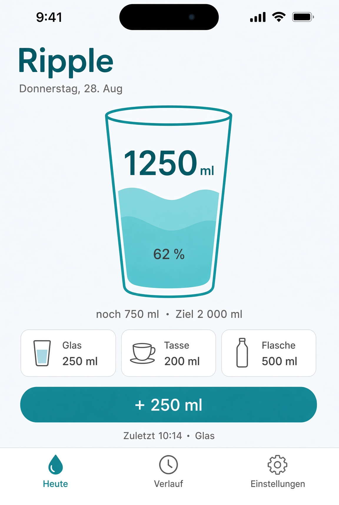
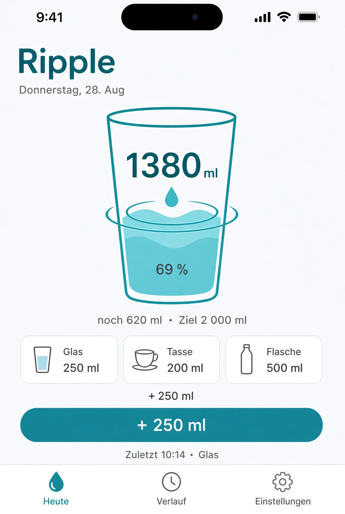
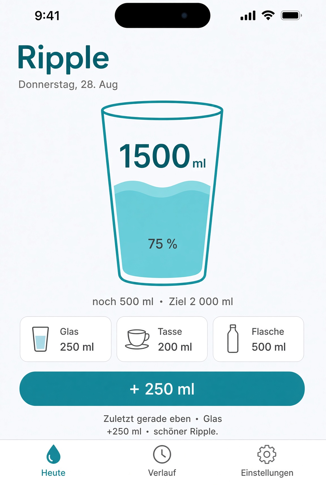

# Ripple — Product Requirements Document

**Dokumenttyp:** Implementierungs-PRD (Single Source of Truth)  
**Empfänger:** Grok Build (Implementation)  
**Produkt:** Ripple – Water Tracker  
**Version:** 1.3 — 28. August 2026  
**Lizenz:** MIT  
**Sprache UI:** Deutsch + Englisch (String Catalogs)  
**Code-Sprache:** English identifiers, German + English copy

Dieses eine Dokument ersetzt alle vorherigen Teilstände. Es ist vollständig genug, um das Projekt ohne Chat-Kontext zu bauen. Wo Konzept-Screenshots vom Generator abweichen, gilt der Fließtext.

---

## 0. Auftrag an Grok Build

Baue eine **Open-Source-App** namens Ripple ausschließlich in **Swift 6 + SwiftUI**.

1. Folge der Architektur in Abschnitt 4 ohne Abweichung.
2. Implementiere den Scope von v1.0 vollständig (Abschnitt 3).
3. Keine Third-Party-Dependencies.
4. Keine Accounts, keine Werbung, keine IAP, keine Analytics.
5. HealthKit und Live Activity gehören zu v1.0.
6. UI folgt Abschnitt 13 und 14. Screenshots in `screens/` sind Richtung, nicht Pixel-Gesetz.
7. Liefere ein Xcode-Workspace inkl. Packages, das auf einem echten Gerät startet. CloudKit-Container und App Group als Platzhalter + README-Anleitung.
8. Domain- und Data-Tests müssen ohne App-Target laufen.

Wenn etwas unklar ist: die strengere, kleinere Variante wählen und als ADR in `Docs/ADR` festhalten. Nicht den Scope erweitern.

---

## 1. Produkt

**Name:** Ripple  
**Store-Name:** Ripple – Water Tracker  
**Tagline:** Hydration, die dir folgt.  
**Bundle-ID-Schema:** `de.stefansturm.ripple` (Team-ID später ersetzen)  
**App Group:** `group.de.stefansturm.ripple`  
**iCloud Container:** `iCloud.de.stefansturm.ripple`  
**GitHub:** Open Source, MIT. Contributor nutzen eigene IDs (`.xcconfig.example`).

Ripple ist ein Hydration-Tracker für alle Apple-Geräte. Wasser loggt man dort, wo man gerade ist (Widget, Watch, Siri, Control Center, Live Activity). Die App ist der ruhige Ort für Stand, Verlauf und Einstellungen.

Positionierung: erwachsen, systemweit, offen. Kein Lama, keine Gießpflanze, keine Paywall.

### 1.1 Erfolgsdefinition

- Ein Wassereintrag ist in unter zwei Sekunden von mindestens fünf Systemflächen möglich.
- Ein Watch-Log erscheint auf iPhone-Widget und Mac nach CloudKit-Sync.
- Repo ist für Dritte in unter 30 Minuten startbar.
- Architektur bleibt in Packages sichtbar und testbar.

### 1.2 Stimme

Duzen, kurze Sätze, keine medizinische Beratung.  
Erfolg: „+250 ml – schöner Ripple.“  
Ziel erreicht: „Heute im Fluss.“  
Leer: „Noch still – erster Schluck?“  
Siri: „Alles klar, 250 Milliliter sind drin. Noch 1,1 Liter bis zum Ziel.“

---

## 2. Nicht-Ziele (nicht bauen)

- Eigenes Backend, Accounts, Analytics-SDKs, Crash-Uploader
- Werbung, Abo, In-App-Kauf
- Android / Web / Kotlin Multiplatform
- UIKit- oder AppKit-Views außer Systemzwang
- TCA, VIPER, globale Coordinator-Religion
- Pflanzen-Pets, Charaktere, Bestenlisten, Social
- Kalorien, Koffein, Makros
- Medizinische Diagnosen
- Familien-Sharing / Shared CloudKit Zones
- iMessage / Share Extension
- CarPlay (nur wenn ohne Extra-Komplexität; sonst weglassen)
- Getränke-Hydrationsfaktoren, Wetterziel, Streaks (v1.1)
- Mehr als DE + EN in v1

---

## 3. Scope v1.0

| ID | Feature | Pflicht |
|---|---|---|
| F01 | Log Intake (ml/oz, Source, Timestamp) | P0 |
| F02 | Quick Add über gespeicherte Behälter | P0 |
| F03 | Tagesziel manuell oder berechnet | P0 |
| F04 | Today-Fortschritt (Pegel, Rest, Pacing) | P0 |
| F05 | History: Tag/Woche/Monat, Edit/Delete | P0 |
| F06 | Einheiten ml und fl oz | P0 |
| F07 | SwiftData + CloudKit + App Group | P0 |
| F08 | Widgets interaktiv (Small, Medium, Lock Screen, StandBy) | P0 |
| F09 | App Intents + App Shortcuts DE/EN | P0 |
| F10 | watchOS App + mind. 2 Komplikationen | P0 |
| F11 | Control Center + Action Button | P0 |
| F12 | Erinnerungen ohne Spam | P0 |
| F13 | Onboarding | P0 |
| F14 | Settings inkl. Sync-Status und Export CSV/JSON | P0 |
| F15 | Design System RippleUI | P0 |
| F16 | Accessibility (VoiceOver, Dynamic Type, Reduce Motion) | P0 |
| F17 | HealthKit Dietary Water write + optionale Workouts | P0 |
| F18 | Live Activity + Dynamic Island mit Quick Add | P0 |
| F19 | Mac Sidebar + Tastatur + optionale Menu Bar | P0 |
| F20 | tvOS Ambient-Gerüst | P0 (minimal) |
| F21 | visionOS Fenster-Gerüst | P0 (minimal) |

v1.1 (nicht jetzt): Getränkearten mit Faktor, WeatherKit-Ziel, Streaks, Household-Zone, Workout-aware Activity.

---

## 4. Architektur (verbindlich)

**Name:** Feature-first Clean MVVM  
**State:** `@Observable` (kein `ObservableObject`)  
**Concurrency:** Swift 6, Strict Concurrency, `@ModelActor` für Writes  
**DI:** Protokolle + Composition Root, keine Service-Locator-Singletons außer dem Container-Factory

### 4.1 Prinzip

> Eine Domain, viele Adapter.  
> Features besitzen Screens, nicht Regeln.  
> Apple-Frameworks tragen Sync, Intents und UI — der Code trägt die Grenzen.

### 4.2 Schichten

```
Apps + Extensions          Composition Root, Szenen
RippleFeatures             Views + @Observable ViewModels
RippleUI                   Tokens, Komponenten, Motion
RippleIntentsCore          AppIntent-Adapter
RippleDomain               Entities, Use Cases, Protocols
RippleData                 SwiftData, CloudKit, HealthKit, Notifications
```

| Schicht | Darf | Darf nicht |
|---|---|---|
| Domain | Use Cases, Goal-Formel, Units | import SwiftUI, SwiftData, CloudKit, HealthKit, WidgetKit |
| Data | Persistenz, Mapping, Projektionen | View-Layout, Siri-Dialoge |
| IntentsCore | Systemvertrag, Phrasen | eigene Mengenlogik |
| UI | Look & Motion | SwiftData `@Query` Writes, HKHealthStore |
| Features | VM orchestriert Use Cases | CKRecord, HKHealthStore direkt |
| Apps | verdrahten | Business-ifs nach Source |

### 4.3 Verboten

- `@Query` direkt zum Schreiben von Intakes in Views
- Zweite Wahrheit in UserDefaults (höchstens Wegwerf-Cache für Widget-Placeholder)
- `LogIntake`-Logik kopiert in Widget/Intent
- HealthKit als Source of Truth
- `#if os()` in ViewModels oder Use Cases

### 4.4 Log-Fluss

```
Widget | Control | Siri | Watch | Button | Notification | Live Activity
                              │
                              ▼
                 LogIntake.run(amount:source:date:)
                              │
                              ▼
              IntakeRepository.save  →  SwiftData App Group
                              │
          ┌───────────────────┼───────────────────┐
          ▼                   ▼                   ▼
   Widget.reload      LiveActivity.update   HealthProjection.write
          │
          ▼
   NotificationScheduler.reschedule()
```

HealthKit-Fehler rollen den Log **nicht** zurück. Health ist Projektion.

Undo = `UndoLastIntake` auf den letzten eigenen Eintrag, nicht verteilter Stack.

### 4.5 ViewModel-Vertrag

```swift
@MainActor
@Observable
final class TodayViewModel {
    var snapshot: TodaySnapshot
    var motion: RippleMotionPhase
    func addDefault() async
    func add(container: Container) async
    func add(milliliters: Int) async
    func undo() async
}
```

Views enthalten keine Use-Case-Logik. Animation beobachtet `snapshot`, schreibt nicht in den Store.

Navigation ist plattformlokal (Tab / Split / Watch-Page). Kein app-weiter Router.

---

## 5. Repository-Struktur

```
Ripple.xcworkspace
  Apps/
    RippleiOS/
    RipplewatchOS/
    RipplemacOS/
    RippletvOS/
    RipplevisionOS/
  Extensions/
    RippleWidgets/          // WidgetKit + Live Activity UI
  Packages/
    RippleDomain/
    RippleData/
    RippleIntentsCore/
    RippleUI/
    RippleFeatures/
  Tests/                    // oder Package-Tests
  Docs/
    ADR/
      ADR-000-architecture.md
      ADR-001-persistence.md
      ADR-002-healthkit.md
      ADR-003-live-activity.md
    CONTRIBUTING.md
  Config/
    Ripple.xcconfig.example
  README.md
```

Xcode: Multiplatform wo sinnvoll, separate App-Targets für Watch/TV/Vision. Shared capabilities: iCloud, App Groups, Background Modes (remote notifications), HealthKit (iOS/watchOS), Push (für CloudKit).

`Ripple.xcconfig.example` enthält:

```
DEVELOPMENT_TEAM =
PRODUCT_BUNDLE_IDENTIFIER = de.stefansturm.ripple
RIPPLE_APP_GROUP = group.de.stefansturm.ripple
RIPPLE_ICLOUD_CONTAINER = iCloud.de.stefansturm.ripple
```

README erklärt: eigenen Container anlegen, IDs ersetzen, Signing, CloudKit Schema deployen.

---

## 6. Domain

### 6.1 Wertetypen

```swift
enum VolumeUnit: String, Sendable, Codable { case milliliters, fluidOunces }

struct Milliliters: Sendable, Hashable, Codable {
    var value: Int  // immer ganzzahlig speichern
}

enum IntakeSource: String, Sendable, Codable {
    case app, widget, intent, watch, control, notification, liveActivity, health
}

enum Beverage: String, Sendable, Codable {
    case water  // v1 nur Wasser; Enum offen für v1.1
}

struct TodaySnapshot: Sendable {
    var date: Date
    var consumed: Milliliters
    var goal: Milliliters
    var remaining: Milliliters
    var percent: Double        // 0...1+
    var entries: [Intake]
    var unit: VolumeUnit
}
```

Einheiten: intern immer Milliliter. UI rechnet über `UnitConverter`.

### 6.2 Persistente Konzepte (Domain, nicht SwiftData)

- `Intake`: id (UUID), date, amountMl, beverage, source, containerId?, note?, isDeleted
- `Container`: id, name, amountMl, isDefault, sort, symbolName
- `GoalSettings`: mode (manual / calculated), manualGoalMl, updatedAt
- `Profile`: preferredUnit, bodyMassKg?, activityLevel, wakeTime, sleepTime, remindersEnabled, healthReadWorkoutsEnabled
- `ReminderRule`: enabled, start, end, intervalMinutes, afterLastSipMinutes

### 6.3 Use Cases (einzige Schreib-API)

| Use Case | Verantwortung |
|---|---|
| `LogIntake` | speichern, Projektionen anstoßen |
| `UndoLastIntake` | letzten nicht gelöschten eigenen Eintrag soft-deleten |
| `EditIntake` | Menge/Zeit ändern |
| `DeleteIntake` | soft delete |
| `ObserveToday` | Snapshot für Datum |
| `ObserveHistory` | Range |
| `UpdateGoal` | manuell oder recalc |
| `CalculateGoal` | Formel |
| `UpdateProfile` | |
| `UpsertContainer` / `DeleteContainer` | |
| `ExportData` | CSV + JSON |
| `StartOrUpdateLiveActivity` | via Port |
| `RescheduleReminders` | via Port |

Ports (Protokolle in Domain):

```swift
protocol IntakeRepository: Sendable { ... }
protocol SettingsRepository: Sendable { ... }
protocol WidgetReloading: Sendable { func reload() async }
protocol LiveActivityControlling: Sendable { func startOrUpdate(TodaySnapshot) async }
protocol HealthProjecting: Sendable { func project(intake: Intake) async }
protocol ReminderScheduling: Sendable { func reschedule(rule: ReminderRule, lastSip: Date?) async }
```

### 6.4 Ziel-Formel

- Ohne Gewicht: Default **2000 ml**, jederzeit überschreibbar.
- Mit Gewicht: `kg * 33` ml, gerundet auf 50 ml.
- Aktivität (nur wenn Profil es sagt): +350 ml je 30 min moderater Belastung aus **heute gelesenen Workouts** (Health, opt-in) oder manuellem Aktivitätslevel (sedentary 0 / moderate +350 / high +700).
- Schwangerschaft/Stillzeit: nur manuelle Zuschläge, Copy: keine medizinische Beratung.
- Wetter: nicht in v1.
- Immer manuell übersteuerbar.

Pacing (Anzeige): Restmenge / verbleibende Wachstunden zwischen wake und sleep. Kein Alarm daraus ableiten außer der Reminder-Regel.

---

## 7. Data / CloudKit / App Group

### 7.1 SwiftData Models

Ein Store, viele Prozesse. `ModelConfiguration(groupContainer: .identifier(appGroup), cloudKitDatabase: .automatic)`.

CloudKit-kompatibel:

- keine Unique Constraints
- Beziehungen optional
- alle Attribute mit Defaults
- `Intake.isDeleted` statt hartem Delete (Sync)

Felder analog Domain + `createdAt`, `updatedAt`.

`SharedContainer.make()` in RippleData:

1. Versuch App Group + CloudKit
2. Fallback App Group lokal
3. Fallback in-memory für Tests/Previews  
Fehler sichtbar über `SyncStatus` (account, importing, failed, unavailable).

### 7.2 Writes

`@ModelActor actor IntakeStore` für alle Writes aus App, Widget, Intent, Watch.

Nach jedem Write:

1. `WidgetCenter.shared.reloadAllTimelines()`
2. Live Activity update
3. Health projection
4. Reminder reschedule

### 7.3 Konflikte

Intakes sind append-only + soft delete, UUID als Identität. Last-Writer-Wins auf Feldebene. GoalSettings: `updatedAt` gewinnt.

### 7.4 Debug vs Release

Getrennte App Groups dokumentieren (`group.de.stefansturm.ripple.debug` optional). CloudKit Development vs Production in README.

---

## 8. HealthKit (v1.0)

**Quelle der Wahrheit:** SwiftData.  
**Health:** Projektion.

### Schreiben

Nach jedem erfolgreichen Log:

- Type: `HKQuantityTypeIdentifier.dietaryWater`
- Unit: liter (Health) aus ml
- Date: Intake.date
- Metadata: `app.ripple.intakeUUID` = Intake.id.uuidString, `app.ripple.source` = source.rawValue

### Lesen

Nur mit **zweiter** expliziter Erlaubnis: Workouts des aktuellen Tages für Goal-Boost. Ablehnung ist gültig. Kein stilles Re-Prompt.

### Dedup

Nie denselben UUID zweimal schreiben. Undo/Delete: korrespondierende HK-Sample löschen, wenn Authorization es erlaubt; sonst ignorieren.

### UI

Onboarding: Health schreiben anbieten. Settings: Status schreiben / Workouts lesen getrennt. App bleibt ohne Health voll nutzbar.

Privacy Nutrition Label: Health (Dietary Water, optional Workouts). Kein Tracking.

Watch: HealthKit nur wenn Target es hergibt; iPhone darf die Projektion führen, Watch-Logs erreichen Health über denselben Use Case sobald der Prozess schreiben darf. Bevorzugt: Projection im Prozess, der `LogIntake` ausführt, wenn Health verfügbar, sonst nach Sync auf iPhone nachziehen (Metadata UUID verhindert Duplikate).

---

## 9. Live Activity + Dynamic Island (v1.0)

### Lebenszyklus

- Start: erster Schluck des Tages **oder** Ende Onboarding, wenn der Nutzer Activities erlaubt.
- Update: nur bei Log/Undo/Goal-Change und um Mitternacht.
- Ende: Mitternacht lokale Zeitzone, oder Nutzer beendet.
- Kein Sekundentakt.

### UI

Lock Screen / Expanded: Ring oder Mini-Pegel, Zahl, Rest, Button **+ Default**.  
Dynamic Island compact: Tropfen + Prozent oder Rest-ml.  
Minimal: Prozent.

Quick Add ruft `LogIntake` mit `source: .liveActivity`.

Attributes z. B. `RippleActivityAttributes` mit ContentState `{ consumedMl, goalMl, defaultAddMl, unit }`.

Battery: Timeline/Activity-Budget respektieren. Eine Activity pro Tag.

---

## 10. App Intents, Shortcuts, Siri

Datei in `RippleIntentsCore`, von App **und** Extension importiert.

Pflicht-Intents:

| Intent | Parameter | Ergebnis |
|---|---|---|
| `LogWaterIntent` | amount (ml oder oz), optional ContainerEntity | Dialog + Snapshot |
| `UndoLastIntakeIntent` | — | Dialog |
| `GetTodayProgressIntent` | — | remaining, percent, goal |
| `SetDailyGoalIntent` | amount | Dialog |
| `OpenTodayIntent` | — | öffnet App |
| `OpenHistoryIntent` | — | öffnet App |

`AppShortcutsProvider` Phrasen DE und EN, Beispiele:

- „Logge Wasser in Ripple“
- „Ripple, 300 Milliliter“
- „Wie viel Wasser noch heute in Ripple?“
- „Nimm den letzten Schluck in Ripple zurück“
- “Log water in Ripple”
- “How much water left today in Ripple?”

Spotlight zeigt die App Shortcuts. Keine SiriKit-Altlasten.

---

## 11. Widgets und Controls

Familien:

- `systemSmall`: Ring + Prozent, Tap öffnet oder +Default wenn interaktiv
- `systemMedium`: Pegel/Ring, Zahl, Buttons +250 / Default / +500 (bzw. oz-Äquivalent)
- `accessoryCircular`, `accessoryRectangular`, `accessoryInline` für Lock Screen + Watch
- StandBy tauglich (dunkel, große Zahl)

Interaktion nur über dieselben App Intents.

Control Center: `ControlWidget` „+ Standardmenge“. Action Button / Camera Control dieselbe Control.

Konfiguration: optional Default-Menge, sonst Profil-Default.

Watch Smart Stack: Relevanz nachmittags/abends höher, wenn Ziel offen (`RelevanceConfiguration` soweit OS es hergibt, sonst Timeline + Relevance).

---

## 12. Plattformen und Screens

Mindestversionen: aktuelles OS zum Bauzeitpunkt (iOS 26 / watchOS 26 / macOS 26 / tvOS 26 / visionOS 26). Nicht künstlich auf iOS 17 zurückgehen.

### 12.1 iPhone

Tabs: **Heute | Verlauf | Einstellungen**.  
Heute: siehe Abschnitt 14.  
Verlauf: Liste nach Tag, Edit/Delete, Wochen-Chart (Swift Charts, schlicht).  
Settings: Profil, Einheiten, Behälter-CRUD, Erinnerungen, Health-Status, Sync-Status, Export, Über, Quelle/Lizenz.

### 12.2 iPad

`NavigationSplitView`: links Today-Kompakt + Behälter, rechts Verlauf/Insights. Multiwindow erlaubt.

### 12.3 Apple Watch

Ein Hauptscreen: Ring + große Plus-Taste. Digital Crown ändert Menge in 50-ml- bzw. 1-oz-Stufen. Vertikal heutige Einträge.  
Komplikationen: circular ring, rectangular remaining.  
Ultra Action Button: +Default wenn konfigurierbar.

### 12.4 Mac

Sidebar. Commands: ⌘N Default-Log, ⌘Z Undo, ⌘1/2/3 Behälter.  
Settings-Szene.  
Menu Bar Extra optional in v1: Fortschritt + +Default.

### 12.5 tvOS

Ambient: großer Pegel, Siri Remote Fokus auf +250 / +500 / +750. Kein Fein-Editing.

### 12.6 visionOS

Fenster + Glass. Log-Buttons im Ornament. Volume optional; wenn Zeit knapp: nur Fenster. Widgets pinnbar, wenn Target Widget-Extension mitnimmt.

---

## 13. Design System (`RippleUI`)

### 13.1 Farbe

| Token | Light | Rolle |
|---|---|---|
| `color.water.deep` | `#0B3D4A` | Text, Icon-Grund |
| `color.water.lagoon` | `#1A7A8C` | Primary |
| `color.water.aqua` | `#4FB3C6` | Fortschritt |
| `color.water.foam` | `#E6F3F5` | Flächen |
| `color.success` | Lagoon | Ziel erreicht |
| `color.danger` | System Red entsättigt | Löschen |

Dark: Deep heller lesbar, Aqua leuchtet, Surfaces kühles Anthrazit.  
Widget muss `fullColor`, `accented`, `vibrant` überleben.

### 13.2 Typo, Raum, Form

- Nur System San Francisco.
- Display-Zahl: large, tabular lining.
- Skala: display, title, body, callout, caption → `Font.TextStyle`.
- 4-pt-Grid. Radius: 12 controls, 20 cards, 28 hero.
- Material: `ultraThinMaterial` sparsam. Keine schweren Drop Shadows.

### 13.3 Komponenten

`RippleProgressView`, `LogButton`, `QuickAddCluster`, `AmountStepper`, `ContainerChip`, `DayHeader`, `RemainingLabel`, `IntakeRow`, `SyncStatusView`, `EmptyState`, `GlassCard`.

Jede Komponente: Preview Light/Dark, Dynamic Type XXXL, Reduce Motion, Watch-Canvas.

### 13.4 Motion-Tokens

| Token | Wert |
|---|---|
| `ripple.duration.quick` | 0,28 s |
| `ripple.duration.hero` | 0,90 s |
| `ripple.duration.confirm` | 1,30 s + 0,30 s Fade |
| `ripple.spring.snappy` | response 0,28 / damping 0,85 |
| `ripple.spring.liquid` | response 0,55 / damping 0,72 |
| `ripple.level.rise` | Strahldauer + 0,14 s Fade, linear, kein Overshoot |
| `ripple.idle.loop` | 6,0 s, kleine Amplitude |
| `ripple.coalesce` | neues Delta an laufende Welle |
| `ripple.undo` | 0,45 s rückwärts |

Reduce Motion: kein Tropfen, keine Ringe, kein Loop. Pegel-Kreuzblende 0,20 s.

---

## 14. iPhone Heute + Add-Animation (verbindlich, SwiftUI-baubar)

**Keine lineare Progress Bar. Kein fotorealistisches Wasser, kein 3D-Glas, kein Mesh-Shader.**  
Der Stand ist ein **stilisiertes Trinkglas**, das sich von unten mit zwei Sinus-Wellen füllt. Das ist mit `GlassShape` + `WaveFill` + `TimelineView` + `clipShape(GlassShape())` 1:1 umsetzbar.

Referenzszene: Ziel 2000 ml, 1250 → Tap +250 → 1500 ml.







### 14.1 View-Hierarchie (so bauen)

```
TodayView
  VStack
    header: "Ripple" + Datum
    RippleHeroView          // Tumbler-Glas ~200×280 pt
    caption: Rest + Ziel
    confirmLabel            // nur nach Log, faded
    QuickAddCluster         // 3 Chips
    LogButton               // "+ 250 ml"
    lastEntryLabel
  TabView: Heute | Verlauf | Einstellungen
```

`RippleHeroView` intern:

```
ZStack {
  WaveFill(level: percent, phase: wavePhase, amplitude: amp)
    .clipShape(GlassShape())
  GlassShape()
    .stroke(lagoon, lineWidth: 3)
  RippleRings(trigger:)     // Ellipsen auf der Wellenlinie, nur beim Log
  DropShape()               // ein Tropfen, Größe = f(addedMl), siehe Ripple_Hero_Motion.md
  VStack { Text(ml); Text("%") }
}
.accessibilityElement(children: .ignore)
.accessibilityLabel(...)
```

`GlassShape`: 2D-Tumbler, oben weiter als unten (Rim-Breite ≈ 1.35 × Bodenbreite). Pfad: Bodenlinie mit leichter Rundung → rechte Wand nach oben außen → Ellipsenbogen für den Rand vorn → linke Wand nach unten. Kein Stiel, kein 3D, keine Highlights-Bitmap. Höhe der Hero-View ca. 280 pt, Breite ca. 200 pt.

### 14.2 WaveFill — Algorithmus

Zwei `Shape`s, leicht phasenversetzt:

```
y = levelY + sin(x * 2π / width + phase) * amplitude
     + sin(x * 4π / width + phase * 1.3) * amplitude * 0.35
```

Pfad: linke untere Ecke des **Glas-Innenraums** → entlang der Sinuslinie nach rechts → rechte untere Ecke → schließen. Fill Aqua 0.85 und zweite Welle Aqua 0.55, 8 pt horizontal versetzt. Immer mit `clipShape(GlassShape())`, damit die Welle den schrägen Wänden folgt. `level` ist die relative Höhe zwischen Glasboden und unterer Rim-Kante, nicht die View-Höhe.

- `level` = min(consumed / goal, 1.2), animiert mit `ripple.spring.liquid`
- `phase` im Idle: `TimelineView(.animation)` erhöht phase langsam (volle Periode ~6 s)
- `amplitude` Idle: 6 pt; während Add: 14 pt für 0,5 s, dann zurück
- Overshoot: level kurz auf target + 0.04 * deltaPercent, dann Ziel
- Reduce Motion: amplitude = 0, phase eingefroren, level mit `.easeInOut(0.2)`

Kein SpriteKit, kein Metal, kein Video.

### 14.3 Add-Motion (nur System-APIs)

| Zeit | Was | SwiftUI |
|---|---|---|
| 0–80 ms | Button scale 0.96, Haptic `.success` | `.symbolEffect` unnötig; `withAnimation(snappy)` + `UIImpact`/`sensoryFeedback` |
| 80–180 ms | `DropShape` offset von Button-Mitte zur Wellenkante | `.offset` + opacity |
| 180–650 ms | 2–3 Ellipsen auf der Wellenlinie, scale + opacity, `level` steigt, Zahl `contentTransition(.numericText())` | |
| 650–900 ms | amplitude zurück, Confirm-Text | |
| 0,9–2,2 s | Confirm fade out | |

Drei schnelle Taps: drei Store-Einträge, **eine** Welle (neues `level` während laufender Animation). Tropfen nur beim ersten Tap einer Serie.

Undo: `level` 0,45 s zurück, kein Tropfen.

### 14.4 Copy und Zahlen

- Idle-Caption: `noch 750 ml · Ziel 2 000 ml`
- Zahl im Glas (oberhalb der Welle): `1250` + `ml` + `62 %` (tabular, `monospacedDigit()`)
- Nach Log: `+250 ml · schöner Ripple.`
- Zuletzt: `Zuletzt 10:14 · Glas`

VoiceOver Glas: „1.250 Milliliter von 2.000. 62 Prozent. Noch 750 Milliliter.“  
Button: „250 Milliliter hinzufügen“.

### 14.5 Was dieser Screen bewusst nicht ist

- Keine horizontale oder ringförmige *ProgressBar*-Komponente als Hauptstand
- Kein Foto-Wasser, keine Caustic-Bitmap, keine Partikel-Engine
- Keine Extra-Tabs, keine Motivations-Card, kein Wolkenhintergrund

Widget / Live Activity: **dasselbe Glas** verkleinert, ohne Tropfenflug, ohne Idle-Loop. Nur `level` + Zahl. Quick Add = kurze Ellipse auf der Wellenlinie, 0,28 s.

---

## 15. Onboarding, Erinnerungen, Export

### Onboarding (3–5 Seiten, skipbar außer Einheit)

1. Willkommen / Metapher
2. Einheit ml oder oz (Locale-Default)
3. Ziel: Default 2 l oder Gewicht eingeben
4. Standard-Behälter
5. iCloud-Hinweis, Health schreiben optional, Widget-Hinweis, Activity-Hinweis

### Erinnerungen

Fenster wake…sleep. Intervall nach letzter Sip (`afterLastSip`, Default 120 min). Keine Notification in Sleep. Keine Starre-Alle-2h-Schleife ohne Bezug zum letzten Log. Notification Action: +Default → `LogIntake`.

Focus Filter: Erinnerungen in Fokuszeiten dämpfen, wenn ohne großen Aufwand machbar; sonst Settings-Pause.

### Export

Settings: JSON (voll) und CSV (Datum, ml, source). Teilen über ShareLink.

---

## 16. App Icon und Marke

Icon: Tropfen + 2–3 konzentrische Ringe auf Deep-nach-Lagoon-Verlauf. Kein Text, kein Glas, kein Häkchen. Watch: nur Tropfen + ein Ring.

Platzhalter in v1: SF Symbol `drop.fill` auf Lagoon reicht, solange Assets-Katalog die Größen füllt. Finales Render kann später ersetzt werden.

---

## 17. Qualität

- VoiceOver auf Today, Log, History, Settings
- Dynamic Type bis AX5; Hero darf schrumpfen, Zahl nicht abschneiden
- Reduce Motion, Increase Contrast, Bold Text
- Haptics abschaltbar
- String Catalogs `de`, `en`
- Locale für Datum und Einheiten
- Privacy Manifest
- Kein Tracking

Tests (müssen grün sein):

- Goal-Formel, Unit-Conversion, Pacing
- Log / Undo / Soft Delete
- Intent `perform()` gegen Fake-Repository
- Health-Metadata-UUID verhindert Doppel-Write (Unit mit Fake HK)
- In-Memory ModelContainer CRUD

CI: `xcodebuild test` Domain + Data (+ iOS-Unit soweit Simulator).

---

## 18. Implementation Order (für Grok Build)

Nicht umdrehen.

0. Workspace, Packages, xcconfig.example, ADR-000  
1. Domain + In-Memory Fakes + Tests  
2. SwiftData Models + SharedContainer + Tests  
3. iOS Today + Settings + Onboarding (ohne CloudKit-Zwang)  
4. RippleUI Hero + Animation inkl. Reduce Motion  
5. CloudKit Capabilities + SyncStatus  
6. App Intents + Shortcuts  
7. Widgets + Controls  
8. watchOS App + Komplikationen  
9. HealthKit Projection  
10. Live Activity + Island  
11. History + Charts + Export  
12. Reminders  
13. Mac  
14. tvOS + visionOS Gerüst  
15. A11y-Pass, DE/EN, README, Privacy Manifest  

---

## 19. Definition of Done v1.0

- [ ] Log, Undo, Today, History, Settings, Onboarding auf iPhone und iPad
- [ ] watchOS-App mit Default-Log und ≥1 Komplikation
- [ ] Mac-App mit Sidebar und Tastaturkürzeln
- [ ] Interaktives Medium-Widget und Lock-Screen-Accessory
- [ ] App Intents + Shortcuts DE/EN
- [ ] Control Center Control
- [ ] SwiftData + App Group + CloudKit, sichtbarer Sync-Status
- [ ] HealthKit Dietary Water + optionale Workouts, App ohne Health voll nutzbar
- [ ] Live Activity + Dynamic Island mit Quick Add, Updates nur bei Logs/Mitternacht
- [ ] RippleUI Tokens + Hero-Animation + Reduce Motion
- [ ] Domain- und Data-Tests grün
- [ ] README startet das Projekt (Container/App Group dokumentiert)
- [ ] VoiceOver-Pass Today + Log
- [ ] String Catalogs EN/DE
- [ ] Keine Third-Party-Dependencies

---

## 20. Offene Defaults (nicht nachfragen, so entscheiden)

| Frage | Default |
|---|---|
| Bundle-ID | `de.stefansturm.ripple` |
| Display-Name | Ripple |
| Default-Ziel | 2000 ml |
| Default-Behälter | 250 / 200 / 500 ml |
| Default-After-Last-Sip | 120 min |
| Health | schreiben anbieten, Workouts extra opt-in |
| Live Activity | starten nach erstem Log, wenn erlaubt |
| tvOS/visionOS | Gerüst, nicht pixelperfekt
| Icon | SF-Drop-Platzhalter + Asset-Vorlage |
| Tests | Swift Testing wo möglich |

---

## 21. Kurz-ADR zum Mitliefern

**ADR-000:** Feature-first Clean MVVM, `@Observable`, Use Cases als einzige Schreib-API, keine TCA-Pflicht.  
**ADR-001:** Ein SwiftData-Store, App Group, CloudKit automatic, ModelActor-Writes, CloudKit-kompatibles Schema.  
**ADR-002:** Health ist Projektion von SwiftData, UUID in Metadata, Fehler blockieren Logs nicht.  
**ADR-003:** Eine Live Activity pro Tag, Update nur eventgetrieben, Quick Add = LogIntake.

---

*Ende PRD 1.2. Grok Build implementiert Abschnitt 18 in dieser Reihenfolge und stoppt bei Abschnitt 19 DoD.*
